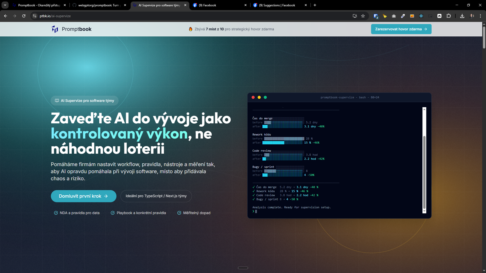

[ ] !!!

[✨😜] Create a page `/ai-supervize-mini`

```text
Ozývají se nám lidé, kteří mají zájem o AI Supervizi jako jednotlivci.
Rádi bychom proto něco takového udělali. Hands-on celodenní workshop jak komplexně přemýšlet nad AI vývojem.
Nikoliv školení Claude Code, ale opravdu komplexní pohled od toho, jak přemýšlet nad nástroji, riziky, verzováním, testováním, code quality.
 V rámci vývoje produktu ideálně pro vývojáře a produkťáky, kteří vyvíjí v TypeScriptu nebo JavaScriptu.
---
V Praze někdy v průběhu května. Max 10 lidí.
```

- This will be the scaled down version of the AI Supervize, which will be more focused on single day workshop for individuals, rather than the full 6-week program for teams.
- Customer can be a company for employees or individuals
- The page should be much much simpler, just hero section, registration, faq and about pavol
- Reuse the effect of supervize terminal in hero section but change the copywriting
- The price is 8 500 CZK per participant, 10 participants per workshop
- Instead of picking plans allow to buy the workshop directly
    - It should look like full registration
    - Add there a slevový kód "SUPER" for 15% off, which will be just in the config and not in the real booking system
        - Just add the information about used code into the note of `Contact` which is sent to the booking system, so we can track how many people used the code
        - Record the used code and computed price redundantly into the `Contact` note
    - We need name, email and company, invoicing details (company / individual) in the form, number of participants (max 10 but depending on availability) note
    - The booking of the workshop fall to the same system as the booking of the free strategy call, just adapt the note
    - List theese days as available for the workshop:
        - 15.5
        - 21.5
- The "🔥 Zbývá 7 míst z 10 pro strategický hovor zdarma" does not make sence on this page
- Create there artificial scarcity by showing the number of remaining seats for the workshop, which should be 8 on 15.5 and 7 on 21.5
    - Theese are just in the config not in the real booking system
- Also create `/skoleni` which will be just a redirect to `/ai-supervize-mini`
- The main bulk of code should be in `businesses` folder
- The configurations (like discount code, available dates, remaining seats) should be in the config file `businesses/config.ts` and not hardcoded there
- Create FAQ section with 5-10 questions and answers about the workshop _(look at page `/` and reuse the FAQ component with different content)_
    - V čem se liší tento supervize od běžného školení nebo workshopu o AI?
        - Supervize není jen o předávání informací, ale o komplexním přemýšlení nad AI vývojem, včetně rizik, testování a verzování.
          Nejde o to, naučit se používat konkrétní nástroj, ale o to, jak přemýšlet nad celým procesem vývoje s AI.
    - Jaké jsou hlavní přínosy pro účastníky?
        - Účastníci získají hluboké porozumění tomu, jak přemýšlet nad AI vývojem, jak řešit rizika, jak testovat a verzovat své projekty s AI.
          Nejen teoretické znalosti, ale i praktické dovednosti a mindset pro práci s AI.
          Konkrétně:
            - Jak nechat víc práce delegovat na AI, místo toho, abych u toho musel sedět?
            - Jak co nejdřív odchytit potenciální chyby a průšvihy?
            - Když už chyba nebo průšvih nastane, jak to vyřešit
            - Jak správně dělit práci pro AI do PRDs.
            - Kdy přecházet na jiný nástroj nebo model?
            - Jak měřit, že se posouvám kupředu, a nejen přidělávám a přidělávám nesmyslné věci, jen proto, že můžu?
            - Konkrétní tipy a triky pro Git, unit testy, e2e testy, psaní typů typescriptu a další, které jsou specificky relevantní v době AI.
    - Jak dlouho trvá školení a jak je strukturované?
        - Školení trvá jeden den of 9:00 do 17:00 s přestávkou na oběd a je strukturované do několika bloků, které pokrývají různé aspekty AI vývoje, od mindsetu, přes konkrétní techniky a nástroje, až po řešení rizik a testování.
          Každý blok obsahuje teoretickou část i praktické cvičení, kde si účastníci mohou vyzkoušet nové přístupy a získat zpětnou vazbu.
    - Jaké jsou požadavky na účastníky?
        - Školení je určeno pro vývojáře a produktové manažery, kteří pracují s TypeScriptem nebo JavaScriptem (případně obecně s webovým nebo aplikačním vývojem) a mají zájem o hlubší porozumění tomu, jak přemýšlet nad AI vývojem.
          Nejsou potřeba žádné předchozí zkušenosti s AI, ale základní znalost AI nástrojů může být užitečná.
- Keep in mind the DRY _(don't repeat yourself)_ principle.
    - For example reuse the terminal effect from the AI Supervize page and adapt it for this new page, instead of creating it from scratch and share as much code as possible between these two pages.
    - Same with reusing header
    - Same with FAQ
    - ...
- In the header of `/ai-supervize-mini` should be link / button "[Pro firmy]" which will link to `/ai-supervize` page
- Do a proper analysis of the current functionality before you start implementing.
- The `ai-supervize-mini` page should be only in Czech language for now
- The `/ai-supervize` page should stay intact, just add button and link to the new `/ai-supervize-mini` as "[Pro jednotlivce]" which will link to `/ai-supervize-mini`
- Update `AGENTS.md` documentation if needed to reflect the changes you made.



---

[-]

[✨😜] foo

- @@@
- Keep in mind the DRY _(don't repeat yourself)_ principle.
- Do a proper analysis of the current functionality before you start implementing.
- Add the changes into the [changelog](./changelog/_current-preversion.md)

---

[-]

[✨😜] foo

- @@@
- Keep in mind the DRY _(don't repeat yourself)_ principle.
- Do a proper analysis of the current functionality before you start implementing.
- Add the changes into the [changelog](./changelog/_current-preversion.md)

---

[-]

[✨😜] foo

- @@@
- Keep in mind the DRY _(don't repeat yourself)_ principle.
- Do a proper analysis of the current functionality before you start implementing.
- Add the changes into the [changelog](./changelog/_current-preversion.md)
