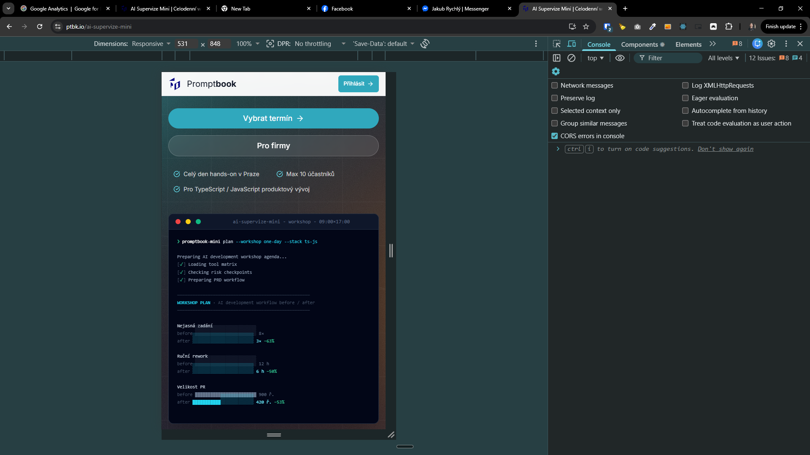

[!] (failed after 2 attempts) 9 minutes by OpenAI Codex `gpt-5.5`

[✨🛹] Fix mobile scrolling for the terminal on hero section of the `/ai-supervize-mini` and `/ai-supervize`

- When user scrolls the page by dragging and darags over the terminal, the page should scroll instead of the terminal.
    - This is currently not working on mobile devices and it is very frustrating for users, because they can't scroll the page by dragging over the terminal, which is a big part of the hero section and it is very common that users try to scroll the page by dragging over it.
- The main action must be scrolling the page, not the terminal, because the terminal is just a visual effect and it is not meant to be interacted with, it is just there to look cool and to show some metrics, but it is not meant to be scrolled or interacted with in any way.
- Keep in mind the DRY _(don't repeat yourself)_ principle.
- Do a analysis of the current functionality before you start implementing.

---

[-]

[✨🛹] bar

- @@@
- Keep in mind the DRY _(don't repeat yourself)_ principle.
- Do a analysis of the current functionality before you start implementing.
- Add the changes into the [changelog](./changelog/_current-preversion.md)

---

[-]

[✨🛹] bar

- @@@
- Keep in mind the DRY _(don't repeat yourself)_ principle.
- Do a analysis of the current functionality before you start implementing.
- Add the changes into the [changelog](./changelog/_current-preversion.md)

---

[-]

[✨🛹] bar

- @@@
- Keep in mind the DRY _(don't repeat yourself)_ principle.
- Do a analysis of the current functionality before you start implementing.
- Add the changes into the [changelog](./changelog/_current-preversion.md)
