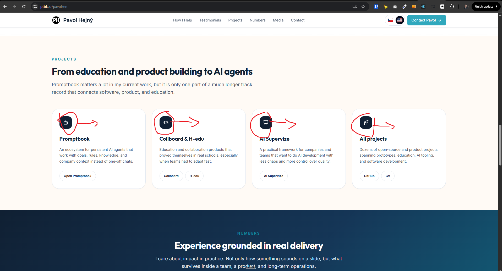
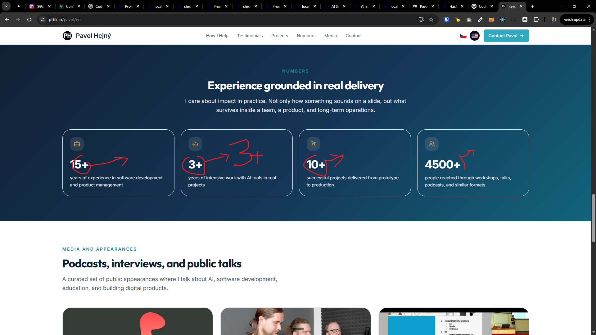
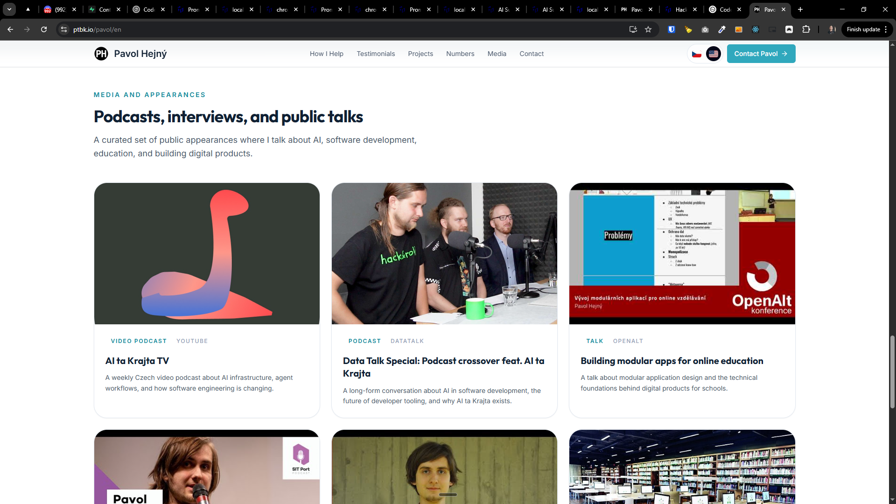
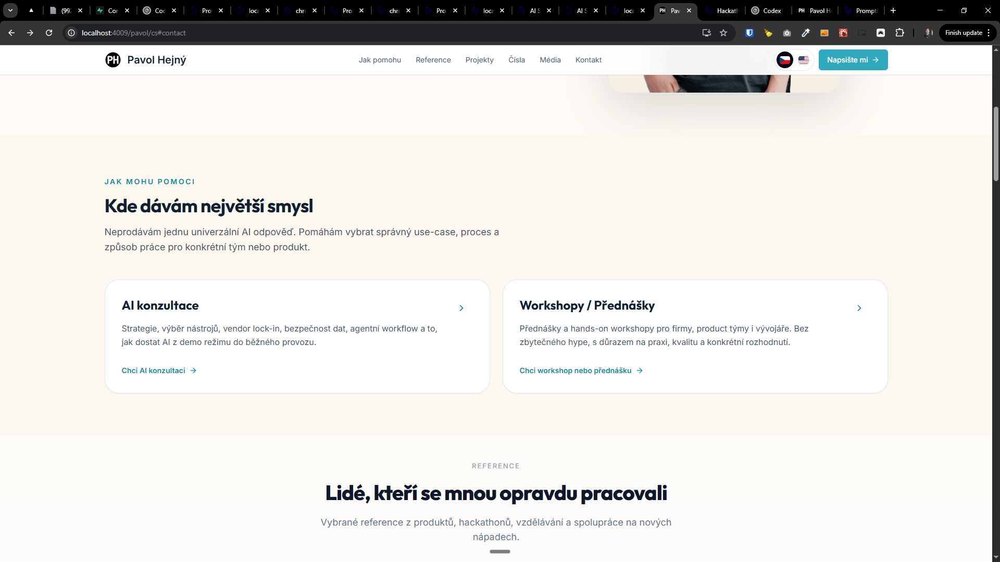
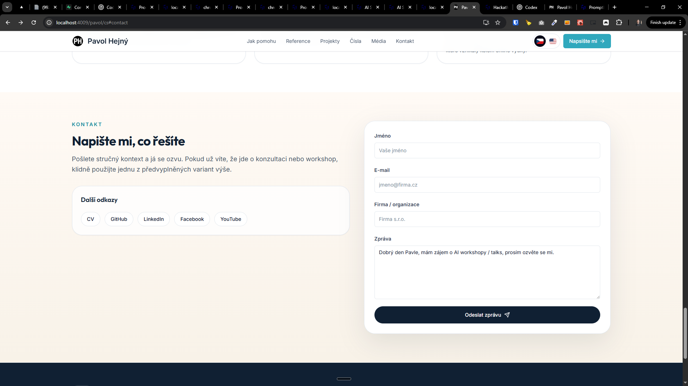
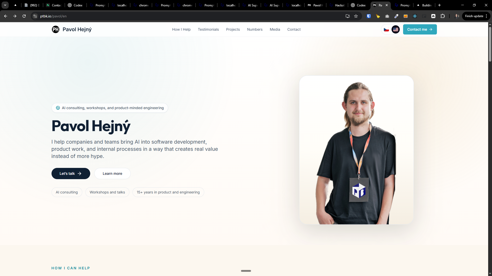
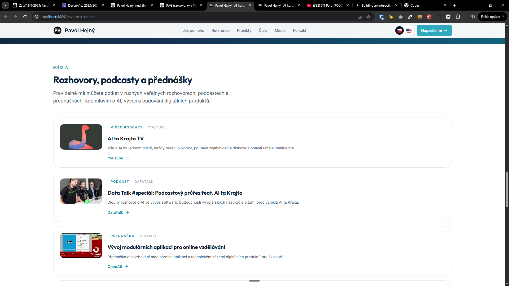
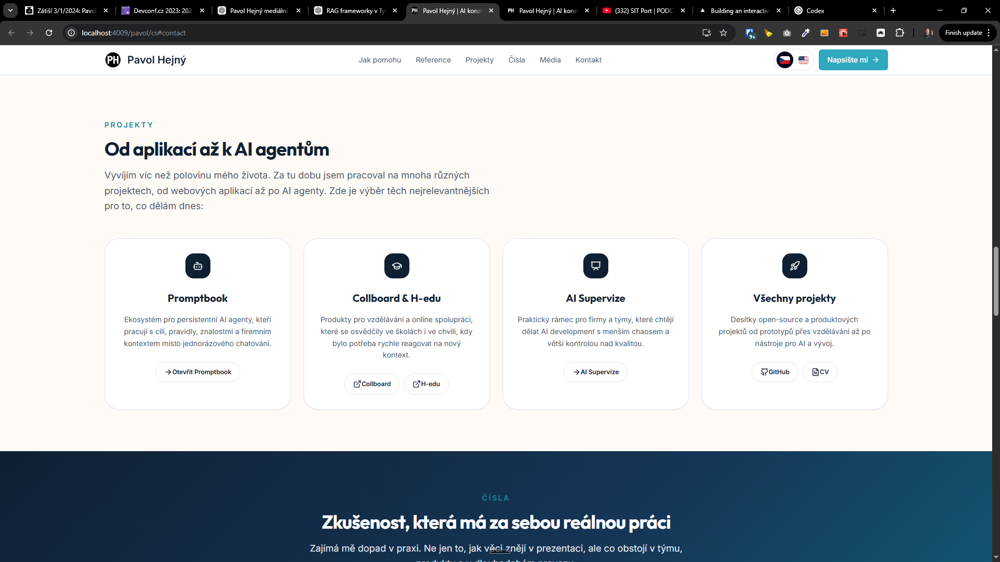

[x] (2 attempts) ~$0.2635 30 minutes by OpenAI Codex `gpt-5.4`

[✨😨] Create pages `/pavol/en` and `/pavol/cs` which will be personal page of Pavol Hejný

- Take inspiration from Pavol Hejný's old personal page https://www.pavolhejny.com/references, locally on C:/Users/me/work/hejny/hejny
- This old page is very outdated but it can serve as a good inspiration
- The structure of the page should be:
    1. Header in same style as other pages, but branded for Pavol Hejný
    2. Hero section with Pavol Hejný's photo, name and short description (Take inspiration from the old page, and `/ai-supervize-mini` page) also [link the CV](https://docs.google.com/document/d/1M0Py3W4eul8WMfzlvlHHBs50tP2hQ1f519QomfAOhcM/edit?usp=sharing)
        - Hero section should be white themed, it should look simmilarly to the hero section on `/ai-supervize-mini` page, but focused on Pavol As person not on the Pavol as the lector of the workshop
    3. How can I help you? - Clicking on theese should lead to contact with pre-filled message based on the clicked item, for example if user clicks on "AI Consulting" the message should be "Hello Pavol, I am interested in AI Consulting, please contact me." and if user clicks on "AI Workshop / Talks" the message should be "Hello Pavol, I am interested in AI Workshop / Talks, please contact me.", respect the page language, keep in mind the DRY _(don't repeat yourself)_ principle
        - AI Consulting
        - AI Workshop / Talks
    4. Testimonials (Look at the old page and reuse the testimonials from there, but use the new component from here)
    5. Projects
        - Promptbook (with link to the page `/`)
        - Collboard & H-edu
        - AI Supervize
        - Link to all projects as Github and CV
    6. Numbers
        - 15+ years of experience in software development and product management
        - 3+ years of intensive work with AI tools in real projects
        - 10+ successfull prokects
        - 4500+ people trained through workshops, talks, podcasts, etc.
    7. Media appearances
        - Link to YouTube videos, podcasts, articles, etc.
            - https://www.youtube.com/@aitakrajta_tv
            - https://www.datatalk.cz/podcast/epizoda-157
            - https://www.youtube.com/watch?v=K0eMvbSID44
            - https://www.youtube.com/watch?v=V9Jd2VfMZoA
            - https://www.youtube.com/watch?v=i7gQtatWSKc
            - https://www.euro.cz/clanky/digitalni-skamny-pandemie-rozpohybovala-zkostnatele-ceske-skolstvi/
        - Add thumbnal / icon / logo of the podcast for each media appearance
        - These should be in one `config-media.ts` file as the source of truth for media appearances
    8. Contact
        - Contact form - should write dara to `subscribeToWaitlist` _(as any other contact form any other page here)_
        - Other contacts _(look at the old page for contacts)_
            - CV
            - GitHub
            - Social media (LinkedIn, Facebook, [YouTube](https://www.youtube.com/@pavolhejny), etc.)
            - Do not include personal email and phone number
- Its personal page of Pavol Hejný not Promptbook page, promptbook is just one project of Pavol Hejný
- Keep in mind the DRY _(don't repeat yourself)_ principle. Reuse components as much as possible, just differ content, but do not create new components if they are not needed, reuse existing ones and adapt them for this new page. You can make or extend existing components if needed by adding new props to them, but do not create new components if they are not needed, reuse existing ones and adapt them for this new page.
- Do a analysis of the current functionality before you start implementing.
- Reuse the testimonials component from other pages and adapt it for this new page, with different testimonials, components should be reused as much as possible, just differ content
- When visitor navigates to `/pavol` it should redirect to `/pavol/cs` or `/pavol/en` based on the browser language, reuse the same pattern and code with `/` redirecting to `/cs` or `/en`
- Language should be switchable between Czech and English from header, do it via the flags
- Logo should be SVG with Pavol Hejný's initials "PH" and it should be made as SVG asset and it should be used in the header and favicon
- The page must look and feel premium on any device and screen size
- You are working with pages `/pavol/en` and `/pavol/cs` and do not change other pages _(except for reusing components and adapting them for this new page, but from the point of visitor of any other page, nothing should change on other pages, only on these two new pages)_
- Use the configuration files to separate content from presentation, for example for media appearances, projects, testimonials, etc. Look at other pages for inspiration on how to do this
- Do smooth scrolling to sections when clicking on the links in the header, just like on other pages _(this can be implemented for other pages as well)_
- Update `AGENTS.md` documentation if needed to reflect the changes you made.

---

[x] ~$0.00 8 minutes by GitHub Copilot `gpt-5.4`

[✨😨] Align the icons to the middle on `/pavol` pages

- Also numbers should be bigger
- Keep in mind the DRY _(don't repeat yourself)_ principle.
- Do a analysis of the current functionality before you start implementing.
- You are working with pages `/pavol/en` and `/pavol/cs` and do not change other pages




---

[x] ~$0.00 16 minutes by GitHub Copilot `gpt-5.4`

[✨😨] The "Podcasts, interviews, and public talks" should be shown as list on `/pavol` pages

- Images on the Podcasts, interviews, and public talks are not very visually appealing, they are just mix of logos, thumbnails, and icons, and they do not look good in the grid, so it would be better to show them as list with smaller thumbnails on the left and title and description on the right, this will make it look more organized and visually appealing
- Also add more item at the end with link to the LinkedIn profile
- Keep in mind the DRY _(don't repeat yourself)_ principle.
- Do a analysis of the current functionality before you start implementing.
- You are working with pages `/pavol/en` and `/pavol/cs` and do not change other pages



---

[x] ~$0.00 5 minutes by GitHub Copilot `gpt-5.4`

[✨😨] Add Footer to `/pavol` pages

- This footer should be branded for Pavol Hejný, make a separate footer component for this page
- But still keep in mind the DRY _(don't repeat yourself)_ principle, if it make sence to share some parts of the existing footer, do it
- Do a analysis of the current functionality before you start implementing.
- You are working with pages `/pavol/en` and `/pavol/cs` and do not change other pages

---

[x] ~$0.00 34 minutes by GitHub Copilot `gpt-5.4`

[✨😨] Add icons to "Kde dávám největší smysl" section

- Each "AI konzultace" and "Workshopy / Přednášky" should have relevant icons
- Do a analysis of the current functionality before you start implementing.
- You are working with pages `/pavol/en` and `/pavol/cs` and do not change other pages



---

[x] ~$0.00 14 minutes by GitHub Copilot `gpt-5.4`

[✨😨] Social media and buttons should have icons

- For example section "Další odkazy"
- Do a analysis of the current functionality before you start implementing.
- You are working with pages `/pavol/en` and `/pavol/cs` and do not change other pages



---

[ ]

[✨😨] Make 3D event badge on PC from Pavol image and box

- Look at https://vercel.com/blog/building-an-interactive-3d-event-badge-with-react-three-fiber
- Keep it light theme
- This should be turned on only on PC and bigger screens, on mobile it should be just static image as it is now
- Keep in mind the DRY _(don't repeat yourself)_ principle.
- Do a analysis of the current functionality before you start implementing.
- You are working with pages `/pavol/en` and `/pavol/cs` and do not change other pages

```typescript
import * as THREE from 'three'
import { useEffect, useRef, useState } from 'react'
import { Canvas, extend, useThree, useFrame } from '@react-three/fiber'
import { useGLTF, useTexture, Environment, Lightformer } from '@react-three/drei'
import { BallCollider, CuboidCollider, Physics, RigidBody, useRopeJoint, useSphericalJoint } from '@react-three/rapier'
import { MeshLineGeometry, MeshLineMaterial } from 'meshline'
import { useControls } from 'leva'

extend({ MeshLineGeometry, MeshLineMaterial })
useGLTF.preload('https://assets.vercel.com/image/upload/contentful/image/e5382hct74si/5huRVDzcoDwnbgrKUo1Lzs/53b6dd7d6b4ffcdbd338fa60265949e1/tag.glb')
useTexture.preload('https://assets.vercel.com/image/upload/contentful/image/e5382hct74si/SOT1hmCesOHxEYxL7vkoZ/c57b29c85912047c414311723320c16b/band.jpg')

export default function App() {
  const { debug } = useControls({ debug: false })
  return (
    <Canvas camera={{ position: [0, 0, 13], fov: 25 }}>
      <ambientLight intensity={Math.PI} />
      <Physics debug={debug} interpolate gravity={[0, -40, 0]} timeStep={1 / 60}>
        <Band />
      </Physics>
      <Environment background blur={0.75}>
        <color attach="background" args={['black']} />
        <Lightformer intensity={2} color="white" position={[0, -1, 5]} rotation={[0, 0, Math.PI / 3]} scale={[100, 0.1, 1]} />
        <Lightformer intensity={3} color="white" position={[-1, -1, 1]} rotation={[0, 0, Math.PI / 3]} scale={[100, 0.1, 1]} />
        <Lightformer intensity={3} color="white" position={[1, 1, 1]} rotation={[0, 0, Math.PI / 3]} scale={[100, 0.1, 1]} />
        <Lightformer intensity={10} color="white" position={[-10, 0, 14]} rotation={[0, Math.PI / 2, Math.PI / 3]} scale={[100, 10, 1]} />
      </Environment>
    </Canvas>
  )
}

function Band({ maxSpeed = 50, minSpeed = 10 }) {
  const band = useRef(), fixed = useRef(), j1 = useRef(), j2 = useRef(), j3 = useRef(), card = useRef() // prettier-ignore
  const vec = new THREE.Vector3(), ang = new THREE.Vector3(), rot = new THREE.Vector3(), dir = new THREE.Vector3() // prettier-ignore
  const segmentProps = { type: 'dynamic', canSleep: true, colliders: false, angularDamping: 2, linearDamping: 2 }
  const { nodes, materials } = useGLTF('https://assets.vercel.com/image/upload/contentful/image/e5382hct74si/5huRVDzcoDwnbgrKUo1Lzs/53b6dd7d6b4ffcdbd338fa60265949e1/tag.glb')
  const texture = useTexture('https://assets.vercel.com/image/upload/contentful/image/e5382hct74si/SOT1hmCesOHxEYxL7vkoZ/c57b29c85912047c414311723320c16b/band.jpg')
  const { width, height } = useThree((state) => state.size)
  const [curve] = useState(() => new THREE.CatmullRomCurve3([new THREE.Vector3(), new THREE.Vector3(), new THREE.Vector3(), new THREE.Vector3()]))
  const [dragged, drag] = useState(false)
  const [hovered, hover] = useState(false)

  useRopeJoint(fixed, j1, [[0, 0, 0], [0, 0, 0], 1]) // prettier-ignore
  useRopeJoint(j1, j2, [[0, 0, 0], [0, 0, 0], 1]) // prettier-ignore
  useRopeJoint(j2, j3, [[0, 0, 0], [0, 0, 0], 1]) // prettier-ignore
  useSphericalJoint(j3, card, [[0, 0, 0], [0, 1.45, 0]]) // prettier-ignore

  useEffect(() => {
    if (hovered) {
      document.body.style.cursor = dragged ? 'grabbing' : 'grab'
      return () => void (document.body.style.cursor = 'auto')
    }
  }, [hovered, dragged])

  useFrame((state, delta) => {
    if (dragged) {
      vec.set(state.pointer.x, state.pointer.y, 0.5).unproject(state.camera)
      dir.copy(vec).sub(state.camera.position).normalize()
      vec.add(dir.multiplyScalar(state.camera.position.length()))
      ;[card, j1, j2, j3, fixed].forEach((ref) => ref.current?.wakeUp())
      card.current?.setNextKinematicTranslation({ x: vec.x - dragged.x, y: vec.y - dragged.y, z: vec.z - dragged.z })
    }
    if (fixed.current) {
      // Fix most of the jitter when over pulling the card
      ;[j1, j2].forEach((ref) => {
        if (!ref.current.lerped) ref.current.lerped = new THREE.Vector3().copy(ref.current.translation())
        const clampedDistance = Math.max(0.1, Math.min(1, ref.current.lerped.distanceTo(ref.current.translation())))
        ref.current.lerped.lerp(ref.current.translation(), delta * (minSpeed + clampedDistance * (maxSpeed - minSpeed)))
      })
      // Calculate catmul curve
      curve.points[0].copy(j3.current.translation())
      curve.points[1].copy(j2.current.lerped)
      curve.points[2].copy(j1.current.lerped)
      curve.points[3].copy(fixed.current.translation())
      band.current.geometry.setPoints(curve.getPoints(32))
      // Tilt it back towards the screen
      ang.copy(card.current.angvel())
      rot.copy(card.current.rotation())
      card.current.setAngvel({ x: ang.x, y: ang.y - rot.y * 0.25, z: ang.z })
    }
  })

  curve.curveType = 'chordal'
  texture.wrapS = texture.wrapT = THREE.RepeatWrapping

  return (
    <>
      <group position={[0, 4, 0]}>
        <RigidBody ref={fixed} {...segmentProps} type="fixed" />
        <RigidBody position={[0.5, 0, 0]} ref={j1} {...segmentProps}>
          <BallCollider args={[0.1]} />
        </RigidBody>
        <RigidBody position={[1, 0, 0]} ref={j2} {...segmentProps}>
          <BallCollider args={[0.1]} />
        </RigidBody>
        <RigidBody position={[1.5, 0, 0]} ref={j3} {...segmentProps}>
          <BallCollider args={[0.1]} />
        </RigidBody>
        <RigidBody position={[2, 0, 0]} ref={card} {...segmentProps} type={dragged ? 'kinematicPosition' : 'dynamic'}>
          <CuboidCollider args={[0.8, 1.125, 0.01]} />
          <group
            scale={2.25}
            position={[0, -1.2, -0.05]}
            onPointerOver={() => hover(true)}
            onPointerOut={() => hover(false)}
            onPointerUp={(e) => (e.target.releasePointerCapture(e.pointerId), drag(false))}
            onPointerDown={(e) => (e.target.setPointerCapture(e.pointerId), drag(new THREE.Vector3().copy(e.point).sub(vec.copy(card.current.translation()))))}>
            <mesh geometry={nodes.card.geometry}>
              <meshPhysicalMaterial map={materials.base.map} map-anisotropy={16} clearcoat={1} clearcoatRoughness={0.15} roughness={0.3} metalness={0.5} />
            </mesh>
            <mesh geometry={nodes.clip.geometry} material={materials.metal} material-roughness={0.3} />
            <mesh geometry={nodes.clamp.geometry} material={materials.metal} />
          </group>
        </RigidBody>
      </group>
      <mesh ref={band}>
        <meshLineGeometry />
        <meshLineMaterial color="white" depthTest={false} resolution={[width, height]} useMap map={texture} repeat={[-3, 1]} lineWidth={1} />
      </mesh>
    </>
  )
}
```



---

[x] (2 attempts) ~$0.3714 17 minutes by OpenAI Codex `gpt-5.5`

[✨😨] Reorganize "Rozhovory, podcasty a přednášky" section

- Add https://ceskepodcasty.cz/podcast/zatisi/zatisi-3-1-2024-pavol-hejny-tomas-studenik
- Add https://devconfcz2023.sched.com/event/1MYeB/2023s-most-interesting-browser-apis
- Make there 3 levels of importance:
    1. Highlights - AI Ta Krajta YouTube channel, Rádio 1
    2. Rest
    3. More (do not show linkedin text, just "more" which will lead to Pavol's LinkedIn profile with all media appearances)
- Keep in mind the DRY _(don't repeat yourself)_ principle.
- Do a analysis of the current functionality before you start implementing.
- You are working with pages `/pavol/en` and `/pavol/cs` and do not change other pages



---

[ ] !!

[✨😨] Add icons to "Projekty, Od aplikací až k AI agentům" section

- Now there are generic icons, it would be better to have the icons of the actual projects, for example for Promptbook use the Promptbook logo, for Collboard use Collboard logo,... but black and white icons, not colored, to match the style of the page
- Do a analysis of the current functionality before you start implementing.
- You are working with pages `/pavol/en` and `/pavol/cs` and do not change other pages



---

[-]

[✨😨] baz

- @@@
- Keep in mind the DRY _(don't repeat yourself)_ principle.
- Do a analysis of the current functionality before you start implementing.
- You are working with pages `/pavol/en` and `/pavol/cs` and do not change other pages

