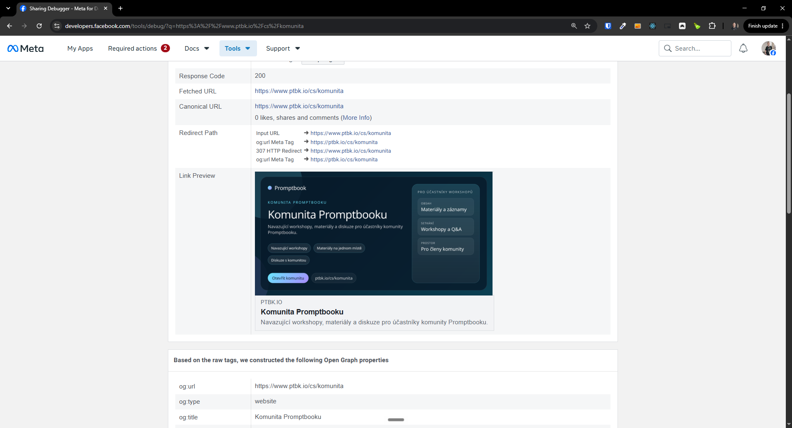

[x] $15.72 28 minutes by Claude Code `opus`

[✨🛁] Enhance the metadata of the pages.

- Enhance the OG Images, Sharing Previews, Metadata for Google, Social Media, etc.
- This is relevant for all the pages.
- Keep in mind the DRY _(don't repeat yourself)_ principle.
- Do a proper analysis of the current functionality before you start implementing.

---

[x] by OpenAI Codex `gpt-5.6-terra` thinking `max` (ChatGPT account) - Implementation ~$0.6978 24 minutes; Testing 4 minutes

[✨🛁] Enhance the metadata of the pages and previews on social media

- Enhance the OG Images, JSON+LD, Sharing Previews, Descriptions, Titles, Metadata for Google, Social Media, etc.
- It should be top notch for social media sharing and SEO
- Also create `sitemap.xml` and `robots.txt` for the pages
- This is relevant for all the pages exceptr the `/admin/*`
- Also for dynamic pages like komunita and workshops
- Keep in mind the DRY _(don't repeat yourself)_ principle.
- Do a proper analysis of the current functionality before you start implementing.

---

[x] by OpenAI Codex `gpt-5.6-terra` thinking `max` (ChatGPT account) - Implementation ~$0.3464 12 minutes; Testing 9 minutes

[✨🛁] Enhance the preview OG Images of pages

- Now the images are generated and are unique but does not look visually appealing
- They contain too much text and lack visual appeal
- This is relevant for all the pages except the `/admin/*`
- Also for dynamic pages like komunita and workshops
- Keep in mind the DRY _(don't repeat yourself)_ principle.
- Do a proper analysis of the current functionality before you start implementing.

