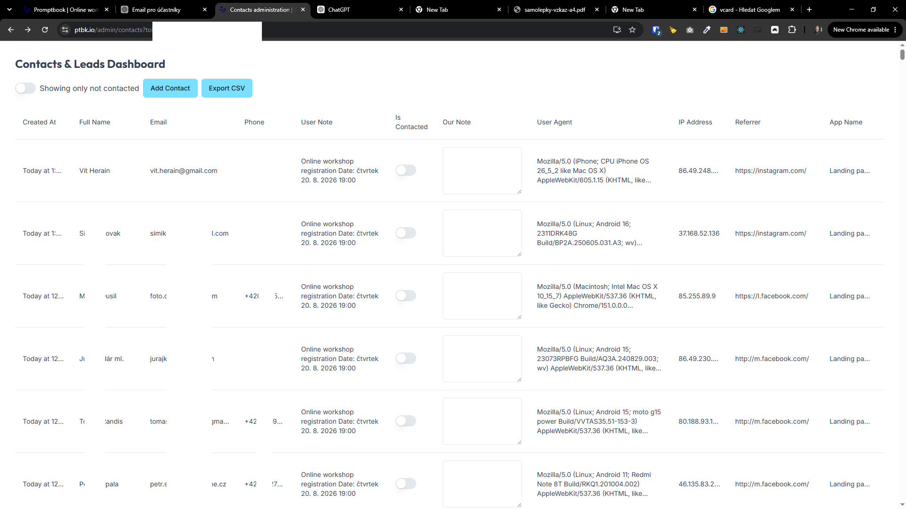

[x] by Claude Code `claude-opus-5` thinking `max` - Implementation $9.33 6 hours; Testing a minute

[✨⇨] Enhance the contacts dashboard

- Allow to resize the columns in the contacts table, adjust what in the columnd is after the elipsis "..."
- Allow to sort by any column in the contacts table.
- Add option to download contacts as CSV or VCARD file.
- Allow to download filtered contacts as CSV or VCARD file.
- When exporting the contacts, you are always exporting the current view. Alongside the exporting buttons, show how many contacts are being exported.
- Also allows filtering by data range, fulltext search, presence of email or phone number,...
- Do not change database structure or gathering of the contacts. You are just editing the viewing and exporting of the contacts
- Keep in mind the DRY _(don't repeat yourself)_ principle.
- Do a proper analysis of the current functionality before you start implementing.



---

[x] by Claude Code `claude-opus-5` thinking `max` - Implementation $2.84 13 minutes; Testing 3 minutes

[✨⇨] Enhance the export to VCARD functionality

The exported contact should look like this:

```vcard
BEGIN:VCARD
VERSION:3.0
N:Hejný;Pavol;;;
FN:Pavol Hejný
EMAIL;TYPE=INTERNET:me@pavolhejny.com
TEL;TYPE=CELL:+420777777777
ORG:Landing page
NOTE:Promptbook contact from Landing page -> OnlineWorkshopRegistration
 Online workshop registration Date: čtvrtek 20. 8. 2026 19:00
REV:2026-08-11T04:19:04.597Z
UID:contact-810
END:VCARD
```

- The `ORG` and `URL` fields should not be filled because they are not representing the organization of the contact, but the landing page where the contact was gathered.
- For the VCARD export the isContacted field is irrelevant and should not be included in the export.
- On the other hand, the `NOTE` field should contain all the information about the contact
    - It should have format `Promptbook contact from <app name> -> <place name>\n<users note>`
- You are working with `/admin/contacts` page.
- Do not change database structure or gathering of the contacts. You are just changing how the data is exported to VCARD.
- Keep in mind the DRY _(don't repeat yourself)_ principle.
- Do a proper analysis of the current functionality before you start implementing.

---

[x] by OpenAI Codex `gpt-5.6-terra` thinking `max` (ChatGPT account) - Implementation ~$0.2532 13 minutes; Testing 3 minutes

[✨⇨] Add pagination to the contacts table

- By default, show 100 contacts per page. Allow to change this to 50, 100, 200, 500, or all contacts.
- When exporting, always export ALL contacts, not just the current page.
- You are working with `/admin/contacts` page.
- Do not change database structure or gathering of the contacts. You are just working with viewing of the contacts
- Keep in mind the DRY _(don't repeat yourself)_ principle.
- Do a proper analysis of the current functionality before you start implementing.

---

[x] by OpenAI Codex `gpt-5.6-terra` thinking `max` (ChatGPT account) - Implementation ~$0.2579 13 minutes; Testing 2 minutes

[✨⇨] The contacts table cannot be horizontally scrolled, fix it

- You are working with `/admin/contacts` page.
- Do not change database structure or gathering of the contacts. You are just working with viewing of the contacts
- Keep in mind the DRY _(don't repeat yourself)_ principle.
- Do a proper analysis of the current functionality before you start implementing.

---

[x] by Claude Code `claude-opus-5` thinking `max` - Implementation $2.25 8 minutes; Testing a minute (automatic commit failed, committing manually)

[✨⇨] When exporting the contacts, export only the current view, not all contacts

- Only exception is pagination, export current filtered contacts, not just the current page.
- You are working with `/admin/contacts` page.
- Do not change database structure or gathering of the contacts. You are just working with viewing of the contacts
- Keep in mind the DRY _(don't repeat yourself)_ principle.
- Do a proper analysis of the current functionality before you start implementing.

---

[x] by Claude Code `claude-opus-5` thinking `max` - Implementation $7.12 22 minutes; Testing 2 minutes

[✨⇨] Save the filtering, sorting, and pagination of the contacts table in the URL get parameters, so that the user can share the link with the current view of the contacts table

- You are working with `/admin/contacts` page.
- Do not change database structure or gathering of the contacts. You are just working with viewing of the contacts
- Keep in mind the DRY _(don't repeat yourself)_ principle.
- Do a proper analysis of the current functionality before you start implementing.

---

[x] by OpenAI Codex `gpt-5.6-terra` thinking `max` (ChatGPT account) - Implementation ~$0.3989 20 minutes; Testing 3 minutes

[✨⇨] Add actions column with edit and delete buttons to the contacts table

- You are working with `/admin/contacts` page.
- Be carefull to change only that contact you are editing/deleting, enforce the `LIMIT 1` in the backend
- Keep in mind the DRY _(don't repeat yourself)_ principle.
- Do a proper analysis of the current functionality before you start implementing.

---

[x] by OpenAI Codex `gpt-5.6-terra` thinking `max` (ChatGPT account) - Implementation ~$0.2188 10 minutes; Testing 2 minutes

[✨⇨] The contacts table cannot be horizontally scrolled, fix it

- Scrolling is only on bottom but when there are many rows, the user cannot scroll to the right because the table is too high. Allow scrolling on top and bottom of the table.
- You are working with `/admin/contacts` page.
- Do not change database structure or gathering of the contacts. You are just working with viewing of the contacts
- Keep in mind the DRY _(don't repeat yourself)_ principle.
- Do a proper analysis of the current functionality before you start implementing.

---

[x] by OpenAI Codex `gpt-5.6-terra` thinking `max` (ChatGPT account) - Implementation ~$0.2334 10 minutes; Testing 3 minutes

[✨⇨] Link the email, phone number, and URLs in the contacts table

- You are working with `/admin/contacts` page.
- Do not change database structure or gathering of the contacts. You are just working with viewing of the contacts
- Keep in mind the DRY _(don't repeat yourself)_ principle.
- Do a proper analysis of the current functionality before you start implementing.

---

[x] by OpenAI Codex `gpt-5.6-terra` thinking `max` (ChatGPT account) - Implementation ~$0.3723 17 minutes; Testing 2 minutes

[✨⇨] Add app name / place name selector filter in the contacts table

- Group the place names under App Names.
- Allow to pick all (default), one, or multiple app names and place names.
    - You can pick one app name and multiple place names under that app name.
- Place names and app names aren't hardcoded. They are derrived from the existing names in the contacts.
- You are working with `/admin/contacts` page.
- Do not change database structure or gathering of the contacts. You are just working with viewing of the contacts
- Keep in mind the DRY _(don't repeat yourself)_ principle.
- Do a proper analysis of the current functionality before you start implementing.

---

@@@@@@ Security of the contacts table

---

[x] by Claude Code `claude-opus-5` thinking `max` - Implementation $4.49 30 minutes; Testing 2 minutes

[✨⇨] When editing contact it fails with error `A 'limit' was applied without an explicit 'order'`, fix it

- Either when editing "Our Note" in place or via "Edit" action
- Allow to edit both "User Note" and "Our Note" in the "Edit" action modal
- Keep the option to edit "Our Note" in place, just fix the SQL error
- When exporting to VCARD to the VCARD NOTE concat both "User Note" and "Our Note" if they are both present, otherwise just the existing one.
- You are working with `/admin/contacts` page.
- Do not change database structure or gathering of the contacts
- Keep in mind the DRY _(don't repeat yourself)_ principle.
- Do a proper analysis of the current functionality before you start implementing.

---

[-]

[✨⇨]

- You are working with `/admin/contacts` page.
- Do not change database structure or gathering of the contacts. You are just working with viewing of the contacts
- Keep in mind the DRY _(don't repeat yourself)_ principle.
- Do a proper analysis of the current functionality before you start implementing.

---

[x] by Claude Code `claude-opus-5` thinking `max` - Implementation $6.35 25 minutes; Testing 2 minutes

[✨⇨] Created at should be sorted by the true date, not by the text.

- You are working with `/admin/contacts` page.
- Do not change database structure or gathering of the contacts. You are just working with viewing of the contacts
- Keep in mind the DRY _(don't repeat yourself)_ principle.
- Do a proper analysis of the current functionality before you start implementing.

---

[ ]

[✨⇨] For both CSV and vCard exports, add an option to download or view the file in a new tab.

- On the right side of the button, there should be some row which will open a small menu which allows to download the export file or open the export file on a new tab.
- Default option is to download the file.
- When you open the export on a new tab, it should pass all the necessary filter parameters to that view. When I refresh this export in future, it should be up to date.
- The exports are authenticated by the same token as the page.
- You are working with `/admin/contacts` page.
- Do not change database structure or gathering of the contacts. You are just working with viewing of the contacts
- Keep in mind the DRY _(don't repeat yourself)_ principle.
- Do a proper analysis of the current functionality before you start implementing.

---

[-]

[✨⇨]

- You are working with `/admin/contacts` page.
- Do not change database structure or gathering of the contacts. You are just working with viewing of the contacts
- Keep in mind the DRY _(don't repeat yourself)_ principle.
- Do a proper analysis of the current functionality before you start implementing.

