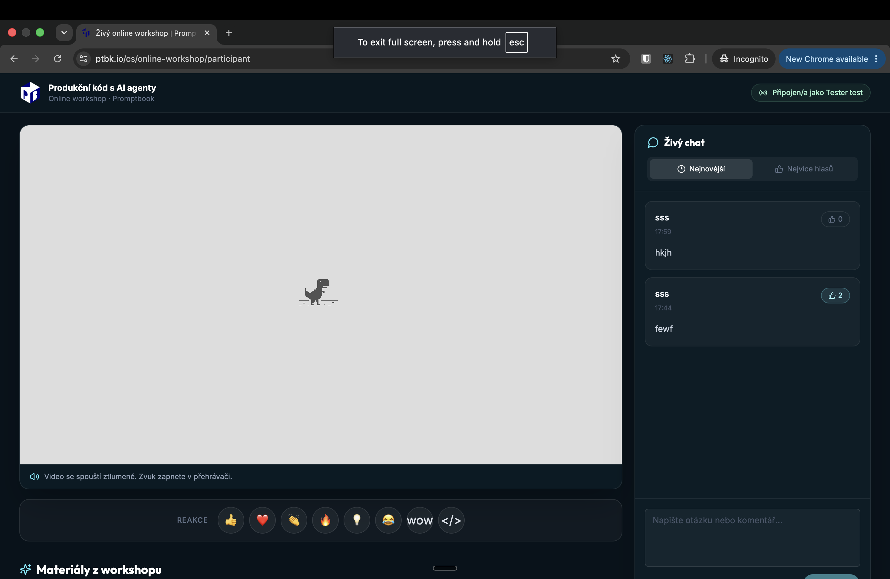
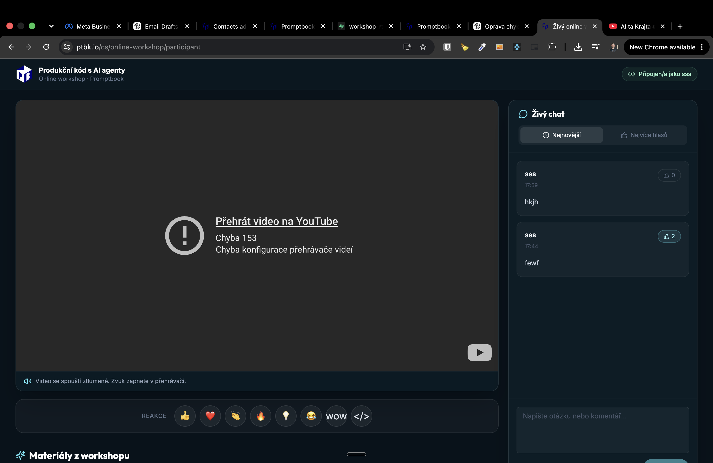
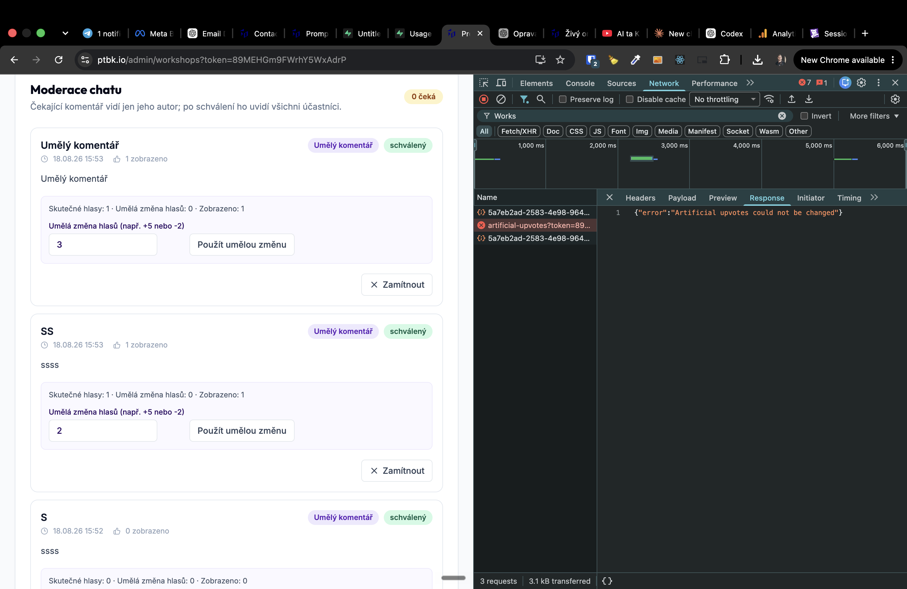
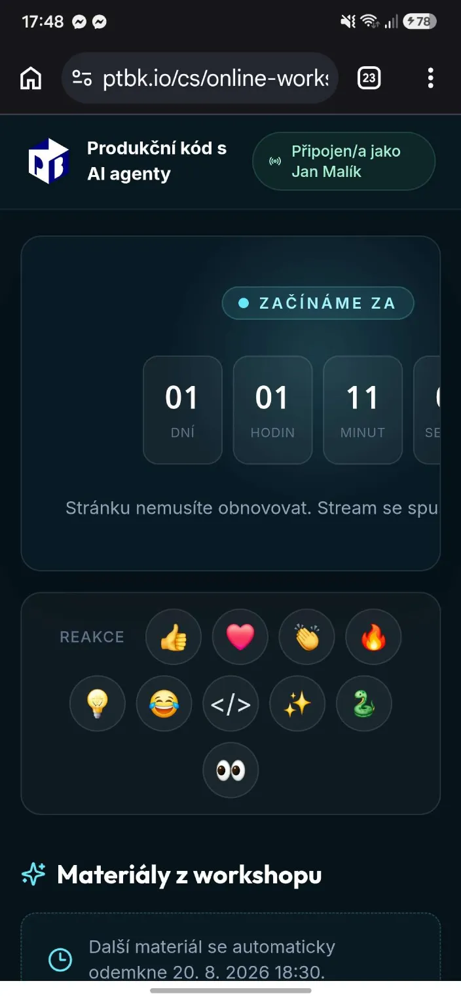

[x] by OpenAI Codex `gpt-5.6-sol` thinking `max` (ChatGPT account) - Implementation ~$0.6882 23 minutes; Testing a minute

[✨🛳] Create a workshop page of `/cs/online-workshop/participant`

- This will be a page for the participant.
- We will have a countdown till the workshop.
- After the countdown is over, there should be a YouTube video which will be the stream, which will be automatically played.
- Also allowed to unlock the content which can be written in Markdown after some time. For example, at 19:30 during the workshop, we can unlock some content.
- Allow editing this content dynamically and flexibly so that if the participant is already connected to the workshop and we add some new content or remove the old one, the participant will see our current version.
- Also every participant must write their name and email to connect (but it can be prefilled from the URL parameters).
    - Theese should be stored in the database with the timestamp of when they connected.
    - Also when user do comment or reaction, it should be stored with the timestamp.
- Add there a simple live chat and emoji reactions with some nice animation
- Also comments on the chat can be upvoted, each upvote should be stored in the database with the timestamp and the user who upvoted.
- Allow to order comments both by most recent and by upvotes.
- When user writes a comment, it should be first approved by the admin, so it should be stored in the database with a status `pending` and only after the admin approves it, it will be visible to all participants.
- The voting and reactions do not require approval, they are visible immediately.
- Keep in mind that the content can be unlocked at any time, not only during the workshop. For example, we can unlock some content after 2 days.
- Do some backend for this logic where we can add the content and set the times.
- Do the database migration in file `migrations/2026-07-0040-workshop-page`
- Allow to pass `?email=...&fullname=...` to the page and prefill the email field in the form.
    - Both parameters are optional, but if they are present, the form should be prefilled with them.
- The backend is not locked under the user and password, but use the simple admin token already used in `/admin` pages
- Do a page in `/admin` that will show dashboard with all the admin pages, to access it you must pass the admin token in the URL, for example `/admin?token=...`
- The tables must be RLS secured
- The miniapp you are implementing is small but it should be implemented in a way that it can be reused for other workshops in the future and also production-ready for 1000+ participants.
- Keep in mind the DRY _(don't repeat yourself)_ principle.
- Do a proper analysis of the current functionality before you start implementing.

---

[x] by OpenAI Codex `gpt-5.6-terra` thinking `max` (ChatGPT account) - Implementation ~$0.6863 43 minutes; Testing a few seconds

[✨🛳] Do some changes and fixes of `/cs/online-workshop/participant` and `/admin/workshops`

- Comments should be shown immediately for the person who wrote them, when the admin approves them, they will be visible to all participants.
- In administration allow to artificially set a positive or negative number of reactions for a comment, so that we can artificially add or remove reactions even if this comment is (not) popular.
- Also allow to create completely new comments in the admin panel, so that we can add some comments to the chat even if no participant has written them.
- Also allow to send arbitrary reaction (even reaction not listed for participants) from the admin panel
- All of these artificial options should be clearly marked as "artificial" in the admin panel and the database, so that we can distinguish them from the real ones.
- In the administration panel show number and list of the participants
- Allow to ban a participant from the commenting and reacting, so that they can only watch the stream and the content, but they cannot comment or react.
- On `/admin/workshops` when I am entering anything, it often "blinks" back to the saved version, so I cannot edit it or must edit it very fast and save it.
- The button "Odeslat" is just bellow the page fold, fix it 
- Fix 
- If you need a change in the database migration, do it in file `migrations/2026-07-0040-workshop-page-1.sql`
- Keep in mind the DRY _(don't repeat yourself)_ principle.
- Do a proper analysis of the current functionality of workshop logic before you start implementing.

---

[x] by OpenAI Codex `gpt-5.6-terra` thinking `max` (ChatGPT account) - Implementation ~$0.8433 29 minutes; Testing a minute

[✨🛳] Do some changes and fixes of `/cs/online-workshop/participant` and `/admin/workshops`

- When showing the list of the participants, show also how many comments, reactions, link clicks, and upvotes the participant made and how long he spent there.
- Send useful information to Google Analytics.
- In administration allow deleting a participant or a comment.
    - Keep the option for disabling interactions, but there should also be a possibility to completely delete the participant or a comment because there will be a lot of participants just for testing purposes.
    - Confirmation should be asked before deleting a participant or a comment.
    - Also allow to clean up all the reactions. (Delete them from the database.)
        - We want to do this before the workshop to see the real amount of the reactions without the testing ones.
- The artificial upvotes aren't saving - 
- In the materials, there can be links.
    - When the user clicks on the link, it should open in a new tab.
    - Track the clicks on the links and show it in the administration.
    - Show information about number of link clicks alongside each material and each participant.
    - Automatically add UTM tracking links to that link.
- Video should have hidden controls and should be autoplayed, also turn off captions
- There should be a bigger warning that the user needs to unmute the video, probably as some nice arrow with the text pointing to a place where the user should unmute the video.
- This warning should disappear when the user does this action.
- The chat is moderated, but the user shouldn't know about this fact. Do not show their notes that the comments need to be approved.
- When the user has disabled interactions, he should still be able to write commands, but these commands should automatically be marked as rejected.
- The Commons should have three states:
    - Pending
    - Approved
    - Rejected
- Also allow admin to make a user trusted, and his comments will be automatically approved.
- Allow markdown formatting in the comments, but disable images, HTML, and other advanced features of the markdown. Allow the basic formatting like bold, italic, and underline....
- In the administration, by default show only the pending comments. Only when the admin selects, he can see the approved or rejected comments.
- For each material in the administration, allow it to unlock immediately.
- When the new material is unlocked, there are some nice animation for the participants, so that they can see that new material is unlocked.
- If you need a change in the database migration, do it in file `migrations/2026-07-0040-workshop-page-2.sql`
- Keep in mind the DRY _(don't repeat yourself)_ principle.
- Do a proper analysis of the current functionality of workshop logic before you start implementing.

---

[ ]

[✨🛳] Add option to add the workshop to the calendar in `/cs/online-workshop/participant`

- Keep in mind the DRY _(don't repeat yourself)_ principle.
    - there is already this feature in `/cs/online-workshop/dekujeme`, share the code and make it reusable.
- the calendar should be generated dynamically based on the information in the workshop
- Do a proper analysis of the current functionality of workshop logic before you start implementing.

---

[ ] !!

[✨🛳] Fix the mobile layout of `/cs/online-workshop/participant`

- The app should look great on all devices.
- it should look great both before the workshop starts and during the workshop

---

[ ] !!

[✨🛳] Link from `/cs/online-workshop/dekujeme` to `/cs/online-workshop/participant?email=...&fullname=...` with prefilled email and fullname

- when the user registers less than 24 hours before the workshop, there isn't the link directly to the participant page. When it registers less than 24 hours before the workshop, there should be a direct link to the participant page because it can happen that the email with the link will be sent to the spam folder and the user will not find it in short time.
- This should be a universal pattern for all workshops
- Do a proper analysis of the current functionality of workshop logic before you start implementing.

---

[ ]

[✨🛳] Allow to change your name in `/cs/online-workshop/participant`

- Keep in mind the DRY _(don't repeat yourself)_ principle
- Do a proper analysis of the current functionality of workshop logic before you start implementing.

---

[ ]

[✨🛳] Show how many people watching in `/cs/online-workshop/participant`

- Keep in mind the DRY _(don't repeat yourself)_ principle
- Do a proper analysis of the current functionality of workshop logic before you start implementing.

---

[ ]

[✨🛳] Allow to reply in chat in `/cs/online-workshop/participant`

- Keep in mind the DRY _(don't repeat yourself)_ principle
- If you need a change in the database migration, do it in file `migrations/2026-07-0040-workshop-page-3.sql`
- Do a proper analysis of the current functionality of workshop logic before you start implementing.

---

[ ]

[✨🛳] Each emoji in `/admin/workshops` Should have its own unique reaction animation

- Do emoji animations for the theese emoji reactions 👍 ❤️ 👏 🔥 💡 😂 </> ✨ 🐍 👀
- But animations should work for any arbitrary text or action, just with generic animation as it is now.
- For especially these reactions, there should be unique animations.
- Do some system for these animations. Use abstractions. Keep in mind the DRY _(don't repeat yourself)_ principle. Keep in mind that the animations should be reusable for other workshops in the future and also production-ready for 1000+ participants in any device.
