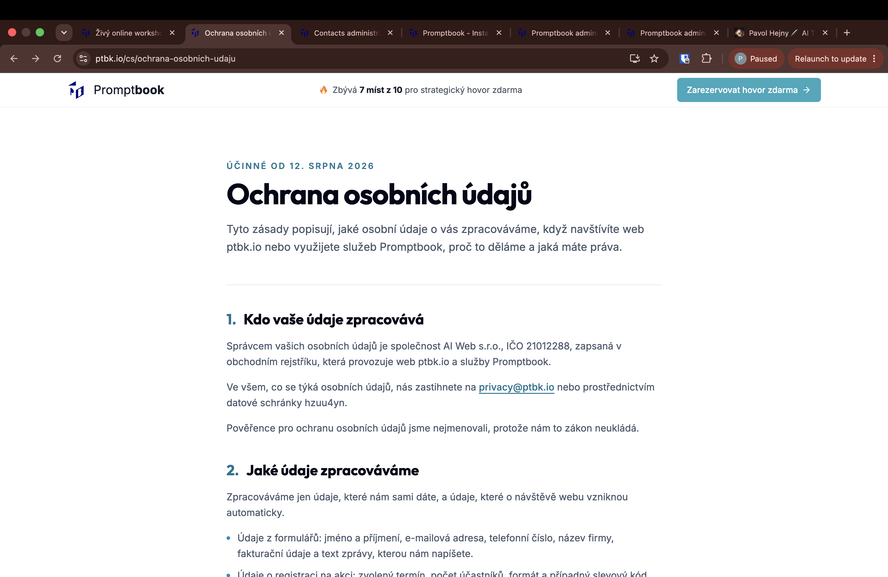
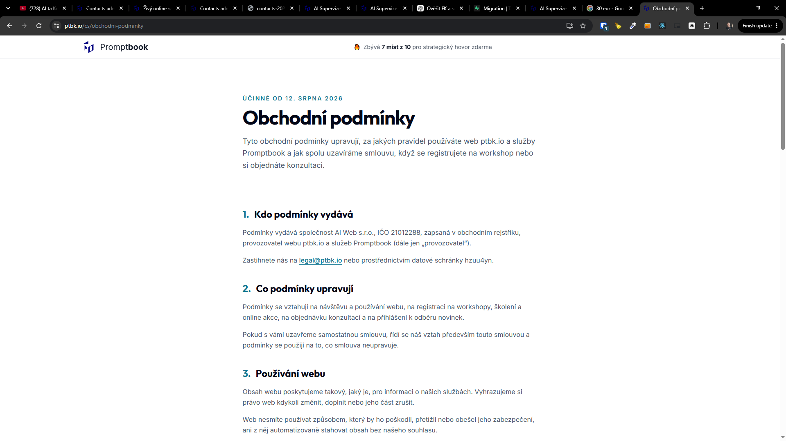

[x] Commited manually

[✨🛅] Add privacy policy and "Obchodní podmínky"

- Both in cs and en (use the variant what page user is in)
- Link both to footer
- Use Privacy policy in cookies banner
- Use Privacy policy in the registration forms across the pages
- Keep in mind the DRY _(don't repeat yourself)_ principle.
- Do a proper analysis of the current functionality before you start implementing.

---

[x] by Claude Code `claude-opus-5` thinking `max` - Implementation .82 7 minutes; Testing a few seconds

[✨🛅] Do not show the primary button "Zarezervovat hovor zdarma" in the terms and privacy policy pages.

---

[ ]

[✨🛅] Do not show "🔥 Zbývá 7 míst z 10 pro strategický hovor zdarma" in the terms and privacy policy pages.

