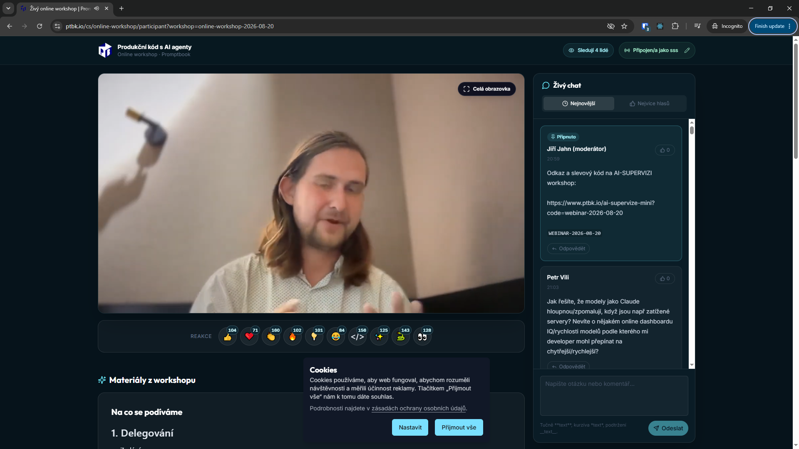

[x] by Claude Code `claude-opus-5` thinking `max` - Implementation $34.94 34 minutes; Testing a minute

[✨👄] Create the moderators for workshops and comunity

- Alongside the Trusted users, create Moderator users.
- Trusted user is invisible. Just his comments are automatically approved.
- On the other hand, the moderator has a batch that is moderator, and also he can approve and disapprove and make trusted users also pin the comments, edit the comments. And disable interactions for users.
- Admin from the admin panel can make or unmake trusted users and moderators. The moderators can make or unmake trusted users, but moderators cannot make other moderators.
- You are working with `/cs/online-workshop/participant`
- You are working with `/admin/workshops`
- If you need a change in the database migration, do it in file `migrations/*.sql`
- Keep in mind the DRY _(don't repeat yourself)_ principle.
- Do a analysis of the current functionality before you start implementing.
- Add the changes into the [changelog](./changelog/_current-preversion.md)

---

[ ]

[✨👄] Links in chat messages from moderators and aftifitial chat messages shiould have active links

- From normal users, the links in chat messages are not active. But from moderators and also from the artificial chat messages, the links should be active and clickable.
- Also transform the links via shortener, so the clicks are tracked.
    - Reuse the same logic applied in the materials
- You are working with `/cs/online-workshop/participant`
- Keep in mind the DRY _(don't repeat yourself)_ principle.
- Do a analysis of the current functionality before you start implementing.
- Add the changes into the [changelog](./changelog/_current-preversion.md)

