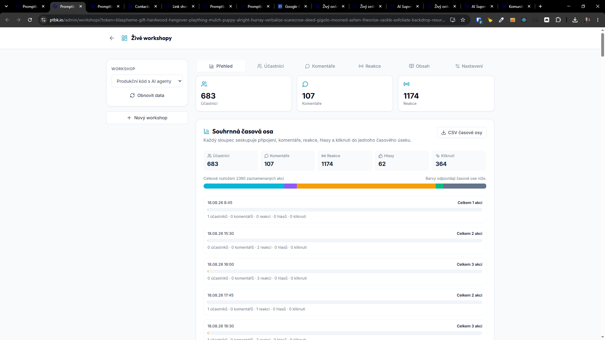
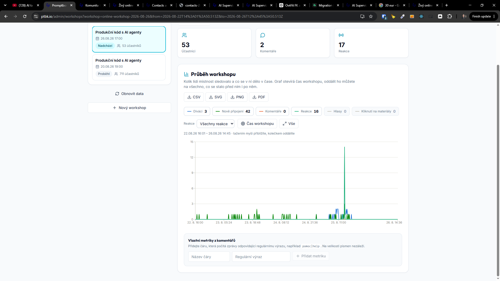

[x] by Claude Code `claude-opus-5` thinking `max` - Implementation $29.64 5 hours; Testing a few seconds

[✨🎽] Enhance the `/admin/workshops` "Přehled"

- The page is blinking on every new data arrival. It should stay visually consistent during a load of the new data. For example, the graph should not blink, but should update smoothly.
- The graph should show the number of participants in an XY graph, like a YouTube video shows the viewers across the time of the video.
- The graph should be zoomable and interactive.
- On the X axis, show the time
- On the Y axis, show the number of participants and also events like comments, reactions, and so on.
- The graph should be interactive. When the user hovers over the graph, show the number
- By default, the graph should be zoomed exactly to the time of the workshop. But the user can zoom out to see the entire graph. For example reactions and viewers before the workshop started, and also after the workshop ended.
- Allow to turn on different lines on the graph, like participants, comments, reactions, and so on.
- Allow to show all the reactions, or only one kind of reaction
- Save theese zoom settings and filters in the GET parameters, so the user can share the link to the graph with the same zoom settings.
- Allow to export the graph to SVG, PNG, PDF or CSV. The CSV should contain the data of the graph, like the number of participants and events across the time.
- Allow to add custom metric based on keywords. For example, the user can add a custom metric for the number of comments containing the word "help". The graph should show this metric as a separate line.
    - Base this on Regex
    - Save this also in the GET parameters, so the admins can share the link to the graph with the same custom metrics.
- Also save the selected tab and workshop in the GET parameters, so the admins can share the link to the same view (not only the graph, but also the selected tab and workshop)
- You are working with `/cs/online-workshop/participant`
- You are working with `/admin/workshops`
- If you need a change in the database migration, do it in file `migrations/*.sql`
- Keep in mind the DRY _(don't repeat yourself)_ principle.
- Do a analysis of the current functionality before you start implementing.
- Add the changes into the [changelog](./changelog/_current-preversion.md)

---

[x] by OpenAI Codex `gpt-5.6-terra` thinking `max` (ChatGPT account) - Implementation ~$0.2795 8 minutes; Testing 6 minutes

[✨🎽] Enhance the `/admin/workshops` "Přehled"

- On the graph create vertical lines for each midnight, so the admins can see the days in the graph.
- Also place a slightly highlited area for the time of the workshop, so the admins can see the time of the workshop in the graph.
- You are working with `/admin/workshops`
- If you need a change in the database migration, do it in file `migrations/*.sql`
- Keep in mind the DRY _(don't repeat yourself)_ principle.
- Do a analysis of the current functionality before you start implementing.

---

[ ]

[✨🎽] Enhance the `/admin/workshops` "Přehled"

- Graph controls should contain zoom in and zoom out buttons and also move right and left buttons.
- It should be easily controllable both on the desktop and mobile phone.
- You are working with `/admin/workshops`
- Keep in mind the DRY _(don't repeat yourself)_ principle.
- Do a analysis of the current functionality before you start implementing.
