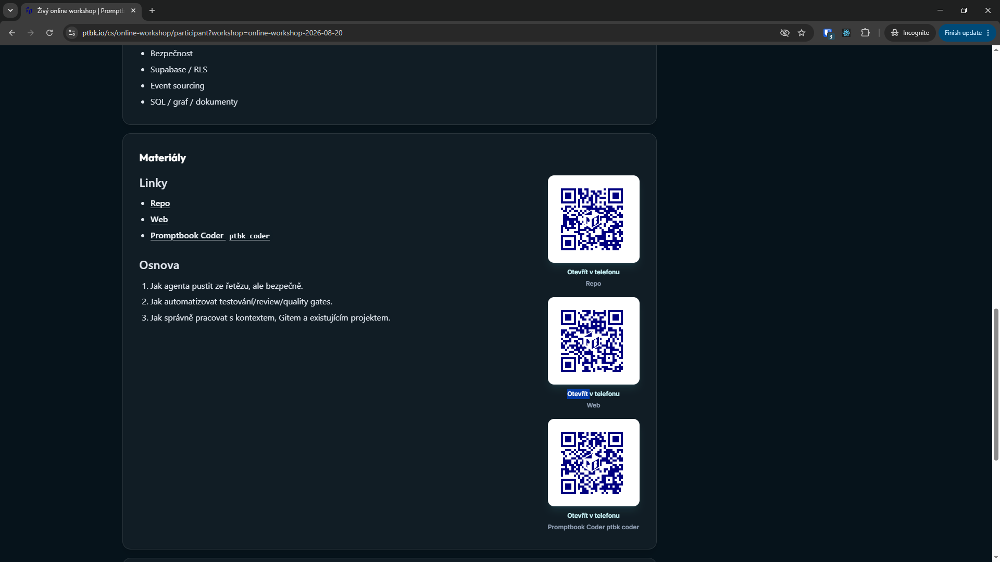
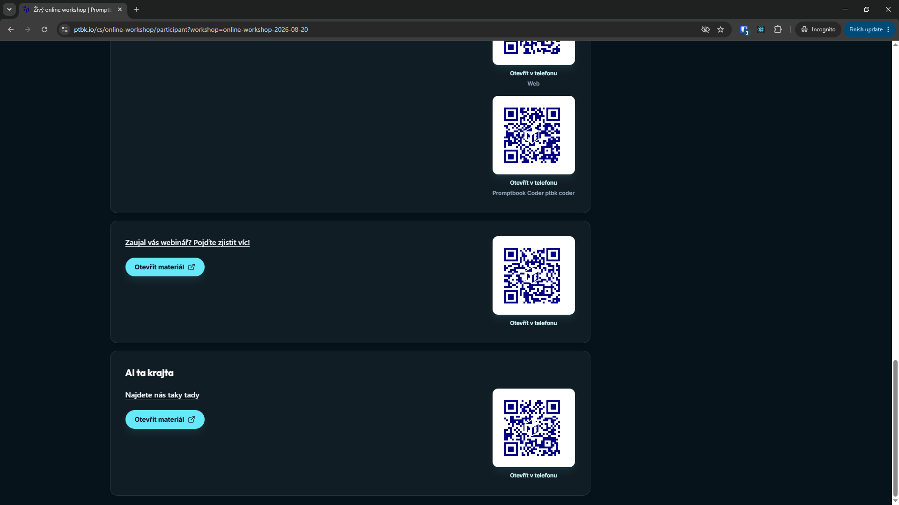
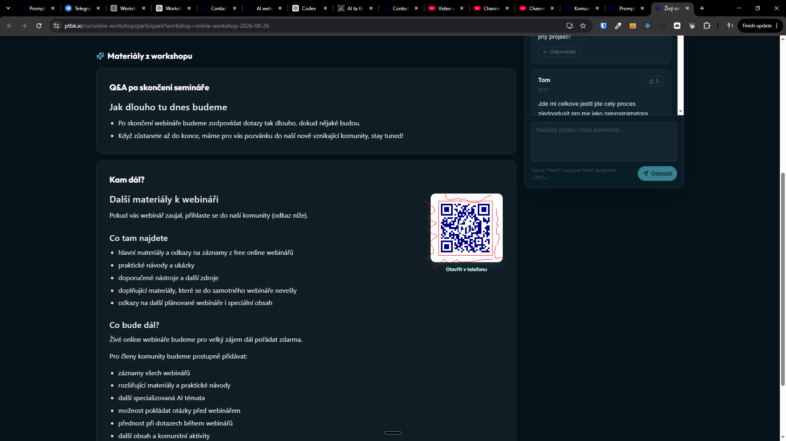

[x] by OpenAI Codex `gpt-5.6-terra` thinking `max` (ChatGPT account) - Implementation ~.52 an hour; Testing 6 minutes

[✨🐪] The link tracking and tracking of the clicks in materials of the online workshop and community should be done through the shortener.

- All the links in the materials should be replaced by the ad hoc links created by the internal shortener we have already implemented in the app.
- Link clicks should be counted from this shortener logic.
- Clicking on a link, there should be no extra JavaScript capturing that click. Whether the user clicks on that link or copies that link, sends that link, it doesn't matter. On all situations, he has the shortener link which tracks the clicks.
- The shortener adds some flag whether the shortened link was created adhoc or by admin manually and also from which app the shortcode was created
    - And in shortener admin allow to filter and sort by these properties.
- You are working with `/cs/online-workshop/participant` and `/cs/komunita/`
- You are working with `/admin/workshops`
- If you need a change in the database migration, do it in file `migrations/*.sql`
- Keep in mind the DRY _(don't repeat yourself)_ principle.
- Do a analysis of the current functionality before you start implementing.
- Add the changes into the [changelog](./changelog/_current-preversion.md)

---

[x] by OpenAI Codex `gpt-5.6-terra` thinking `max` (ChatGPT account) - Implementation ~$0.2849 9 minutes; Testing 5 minutes

[✨🐪] Alongside all the materials, show the QR code when showing the desktop version of the workshop participant app or community.

- Use already existing QR code logic implemented in shortener.
- You are working with `/cs/online-workshop/participant` and `/cs/komunita/`
- You are working with `/admin/workshops`
- Keep in mind the DRY _(don't repeat yourself)_ principle.
- Do a analysis of the current functionality before you start implementing.
- Add the changes into the [changelog](./changelog/_current-preversion.md)

---

[x] by OpenAI Codex `gpt-5.6-terra` thinking `max` (ChatGPT account) - Implementation ~$0.2824 10 minutes; Testing 6 minutes

[✨🐪] Alongside all the materials, there is the QR code

- There should be smaller white padding around the QR code, so it looks better
- Now there is a big ugly padding/margin/border around the QR code.
- Ideally it should be as small as possible while still being clearly scannable.
- They must be also same from all sides.
- Also remove the "Otevřít v telefonu" - it is obviously redundant when showing the QR code.
- Keep in mind the DRY _(don't repeat yourself)_ principle - Do this principle throughout the repository.
- Do a analysis of the current functionality before you start implementing.

