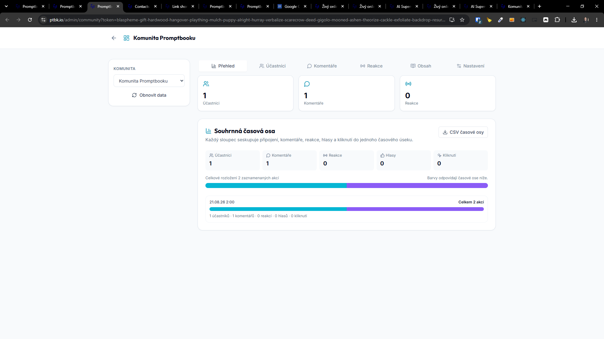

[x] by OpenAI Codex `gpt-5.6-terra` thinking `max` (ChatGPT account) - Implementation ~$0.5528 20 minutes; Testing a minute

[✨💪] Create a page `/cs/komunita`

- Get inspiration from the workshop participant page. There should be a waiting room with full name and email, which can be breath filled from the get parameters, and the stage.
- In the community, list and link all the workshops.
- Create an administration for the community.
- For now, do not create the English version of this page, but be aware that in future, this page can be added in English as well.
- There are multiple workshops, but just one community.
- Keep in mind the DRY _(don't repeat yourself)_ principle.
    - Share the components and design patterns with the workshop participant page.
- Do a analysis of the current functionality before you start implementing.
- If you need a change in the database migration, do it in file `migrations/*.sql`
- Get inspiration from `/cs/online-workshop/participant`
- Add the changes into the [changelog](./changelog/_current-preversion.md)

---

[x] by Claude Code `claude-opus-5` thinking `max` - Implementation $4.44 14 hours; Testing a minute

[✨💪] The community isn't realtime and hasnt start and end, also there is just one community so there should be no community picker in admin

- The community isn't realtime and hasnt start and end and no stage

- Keep in mind the DRY _(don't repeat yourself)_ principle.
    - Share the components and design patterns with the workshop participant page and other pages.
- You are working with `/cs/komunita`
- Add the changes into the [changelog](./changelog/_current-preversion.md)

---

[ ]

[✨💪] Fix "The community isn't realtime and hasnt start and end, also there is just one community so there should be no community picker in admin"

-   @@@
-   You have implemented the "The community isn't realtime and hasnt start and end, also there is just one community so there should be no community picker in admin" feature, but it is not working, fix it

