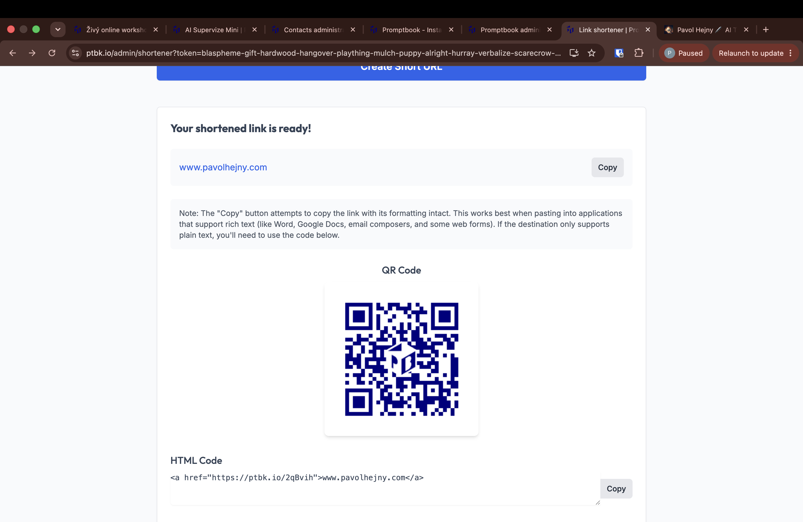

[x] by OpenAI Codex `gpt-5.6-terra` thinking `max` (ChatGPT account) - Implementation ~$0.4070 17 minutes; Testing a minute

[✨👮] The URL shortener should be under the admin.

- Move the URL shortener from `/shortener` to `/admin/shortener`.
- Add it to the admin menu.
- To generate a code, it, you must be authenticated as an admin via the admin token
- To use the generated link, keep the functionality as it is. The generated links are public
- Keep in mind the DRY _(don't repeat yourself)_ principle.
- Do a proper analysis of the current functionality before you start implementing.
- Add the changes into the [changelog](./changelog/_current-preversion.md)

---

[x] by Claude Code `claude-opus-5` thinking `max` - Implementation $9.91 23 minutes; Testing a minute

[✨👮] In the link shortener in administration there should be list of all shortened links and you should be able to do CRUD operations with them.

---

[ ]

[✨👮] Below text "Your shortened link is ready!" should be the shortened link not the original link

