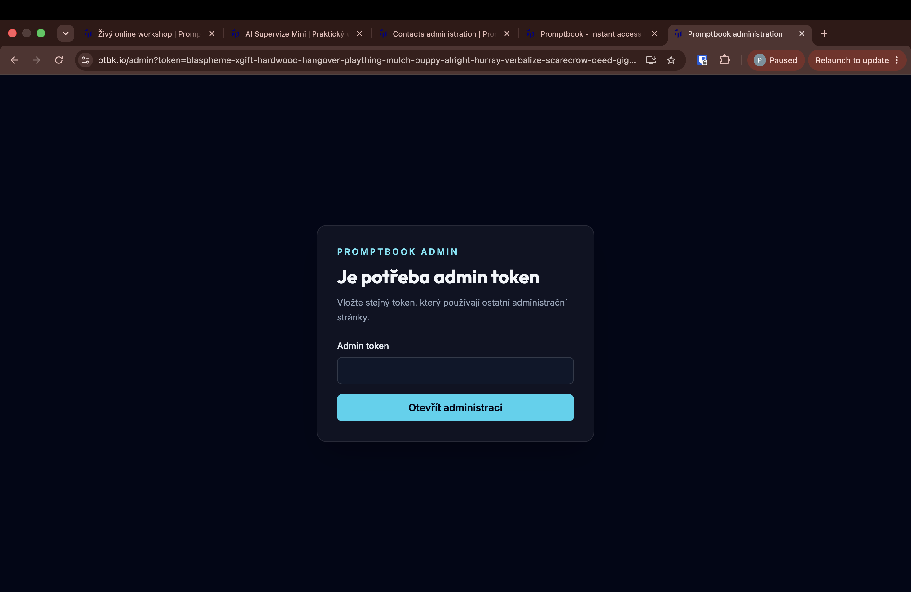
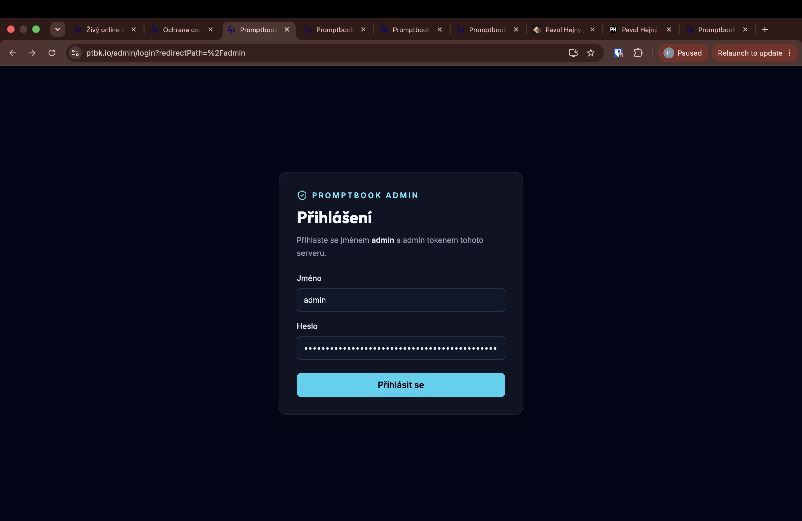
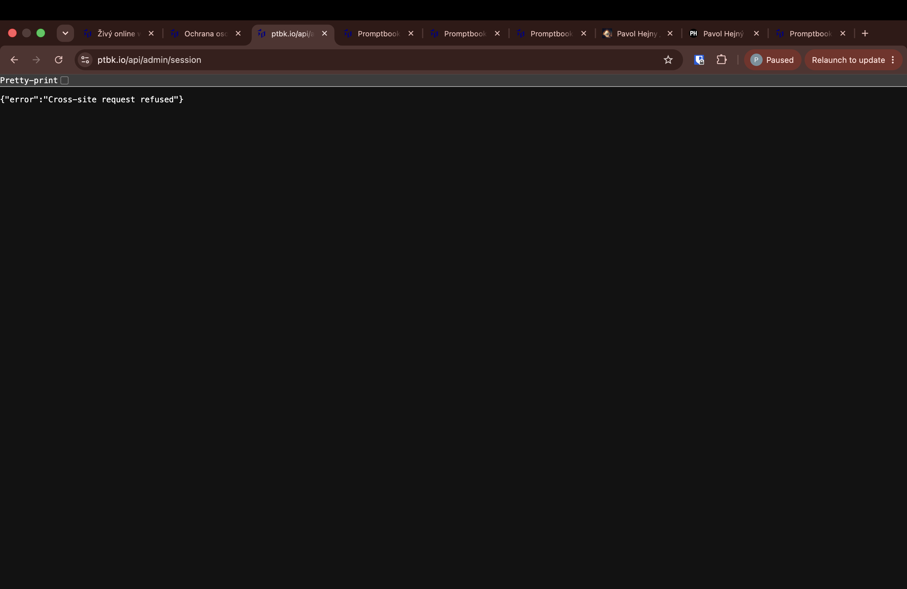

[x] by Claude Code `claude-opus-5` thinking `max` - Implementation 3.84 4 hours; Testing a minute

[✨🍃] Instead of admin to can create a proper login form.

- Login should be saved in classic session as the user logins does not in the GET parameters.
- The credentials will be still hard coded. The username is `admin`, and password is the admin token. The admin token is in the `.env` file.
- Keep in mind the DRY _(don't repeat yourself)_ principle.
- Do a analysis of the current functionality before you start implementing.
- Add the changes into the [changelog](./changelog/_current-preversion.md)

---

[x] by OpenAI Codex `gpt-5.6-terra` thinking `max` (ChatGPT account) - Implementation ~$0.3174 9 minutes; Testing a few seconds

[✨🍃] Fix the login on admin pages.

- When I try to log in it fails with "{"error":"Cross-site request refused"}"

