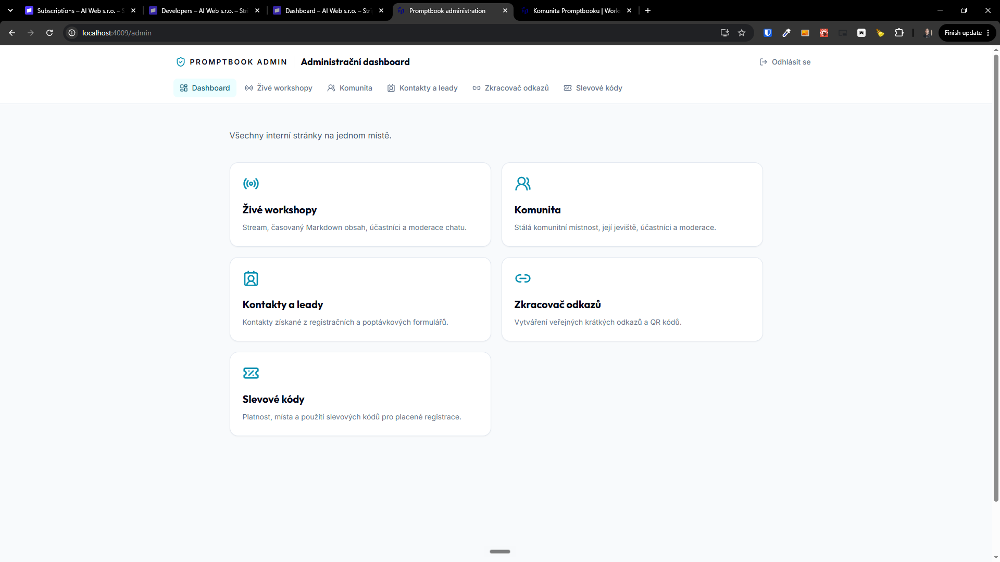
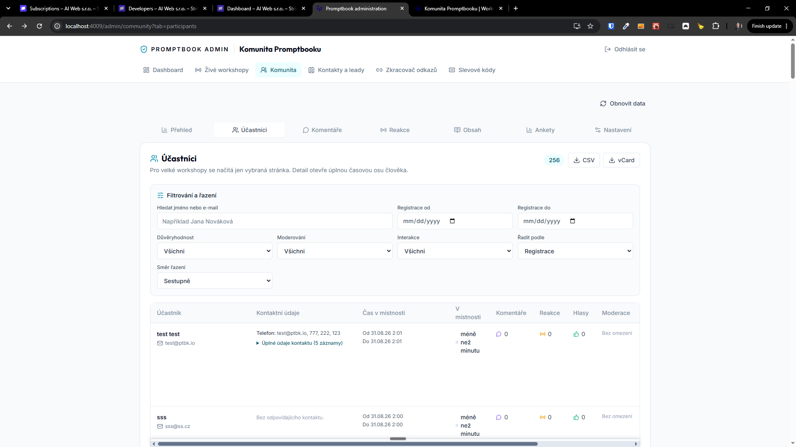
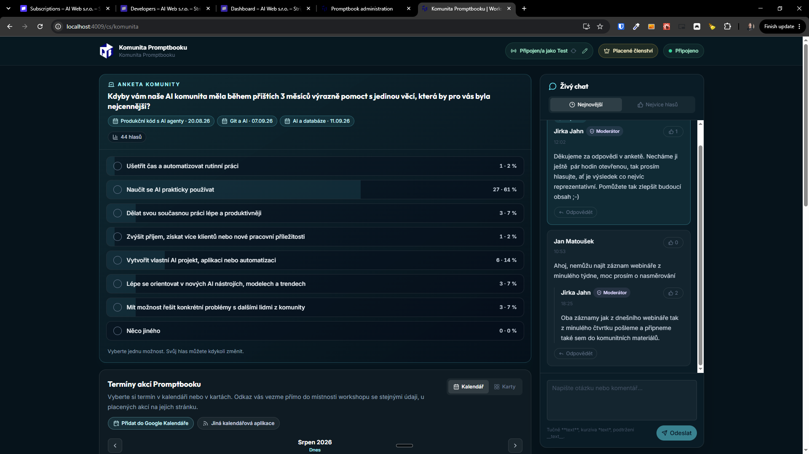
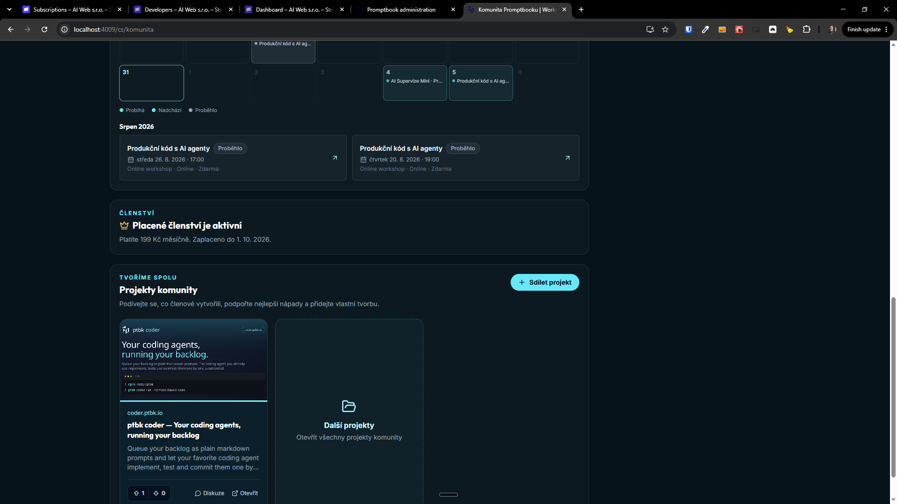

[x] by Claude Code `claude-opus-5` thinking `max` - Implementation $28.58 39 minutes; Testing 6 minutes

[✨🏕] Allow to purchase community membership directly on the community app.

- We already have set up payment gate Stripe
- Allow to use test mode / card for testing
- Just leave me instructions on how to configure payment gate in `AGENT_MESSAGE.md`
- Do it directly on `/cs/komunita` avoid `/cs/komunita/clenstvi`
- Keep in mind the DRY _(don't repeat yourself)_ principle.
- Do a analysis of the current functionality before you start implementing.
- Add the changes into the [changelog](./changelog/_current-preversion.md)

---

[x] by OpenAI Codex `gpt-5.6-terra` thinking `max` (ChatGPT account) - Implementation ~.62 36 minutes; Testing 6 minutes

[✨🏕] The payed memberships should have its admin section

- All users in `/admin/community?tab=participants` should have their membership status in the table
- Also add separate section for managing and seeing paid memberships and payments
    - 
- Interlink theese sections, so that admins can easily navigate between participant list and paid memberships management.
- Keep in mind the DRY _(don't repeat yourself)_ principle.
- Do a analysis of the current functionality before you start implementing.
- Add the changes into the [changelog](./changelog/_current-preversion.md)

---

[ ]

[✨🏕] The membership status / payment gate / plans should be opened in popup modal in community app when clicked on "Free Membership" / "Paid Membership" badge

- Now the membersip is among the materials, move it to separate popup modal.
- Do it directly on `/cs/komunita` avoid `/cs/komunita/clenstvi`
- Keep in mind the DRY _(don't repeat yourself)_ principle.
    - Other parts of the system are using modals (for example materials), reuse the same components and code
- Do a analysis of the current functionality before you start implementing.
- Add the changes into the [changelog](./changelog/_current-preversion.md)

---

[ ]

[✨🏕] Allow to cancel community membership directly from the community app membership popup modal

- Allow users to cancel their community membership directly from the membership popup modal.
- Be aware that membership can last some days even after cancellation.
- Show this cancellation status in the "Free Membership" / "Paid Membership" badge
- Allow to re-activate their membership after cancellation easily.
- Ask before cancelling the membership to confirm the action
- Do it directly on `/cs/komunita` avoid `/cs/komunita/clenstvi`
- Keep in mind the DRY _(don't repeat yourself)_ principle.
- Do a analysis of the current functionality before you start implementing.
- Add the changes into the [changelog](./changelog/_current-preversion.md)

