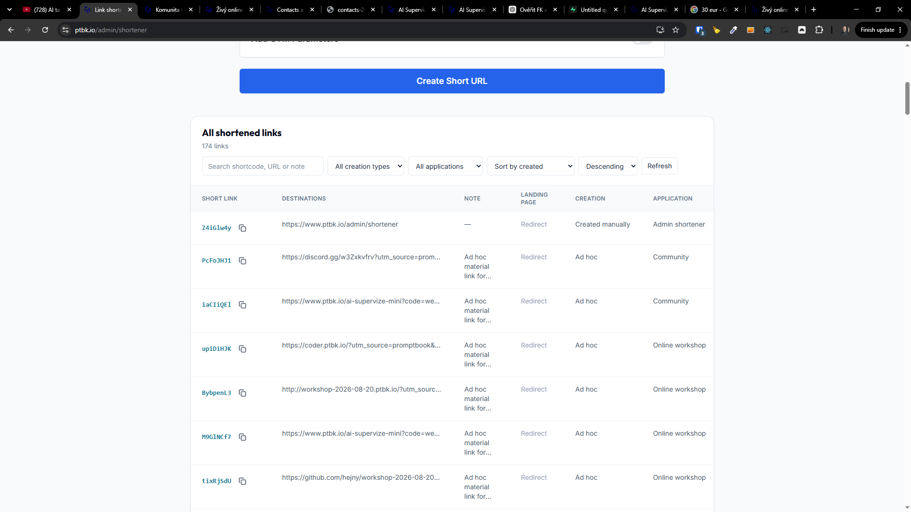

[ ]

[✨☕️] In `/admin/shortener` show number of clicks for each shortened link

- Also allow to click into each link and show the list of all clicks for that link, with timestamp and IP address of the click,...
- Save this and filters into the GET parameters, so you admins can share the link with the filters and also you can bookmark it.
- Keep in mind the DRY _(don't repeat yourself)_ principle.
- Do a analysis of the current functionality before you start implementing.
- Add the changes into the [changelog](./changelog/_current-preversion.md)

