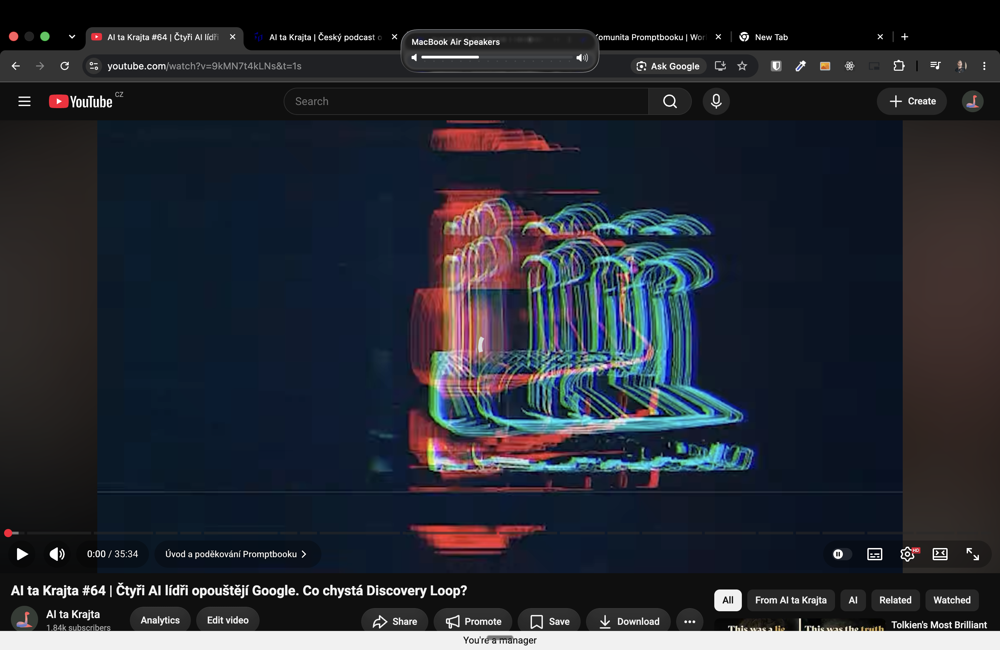
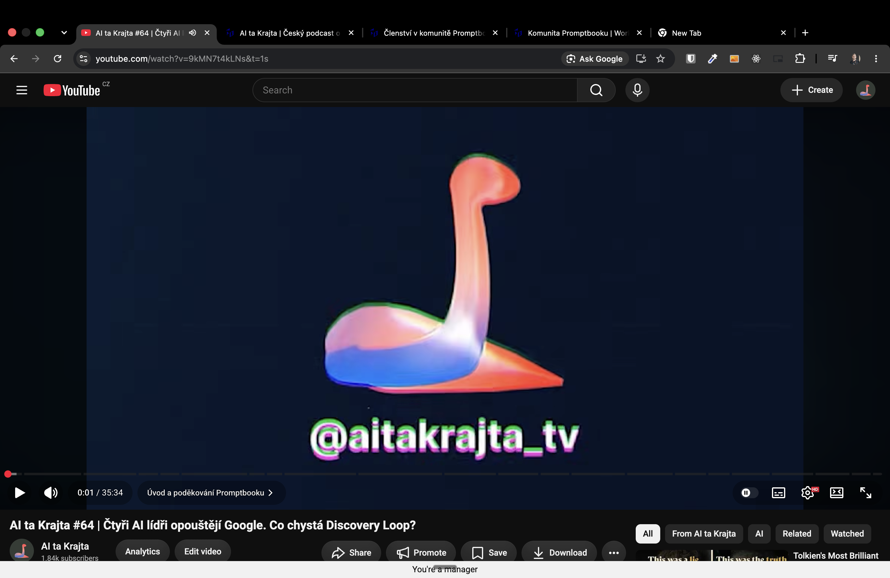
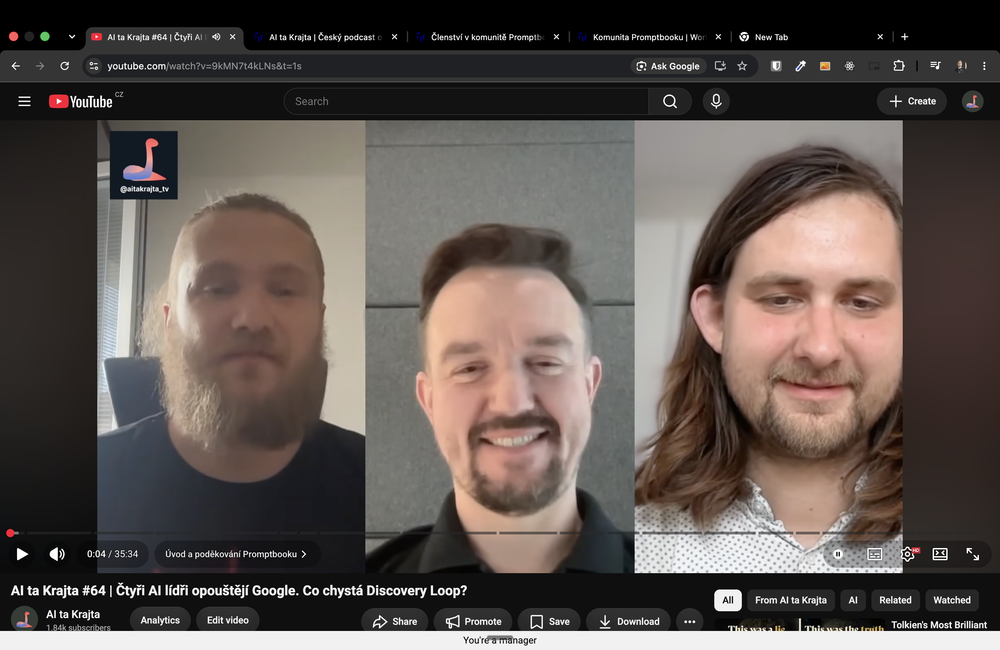
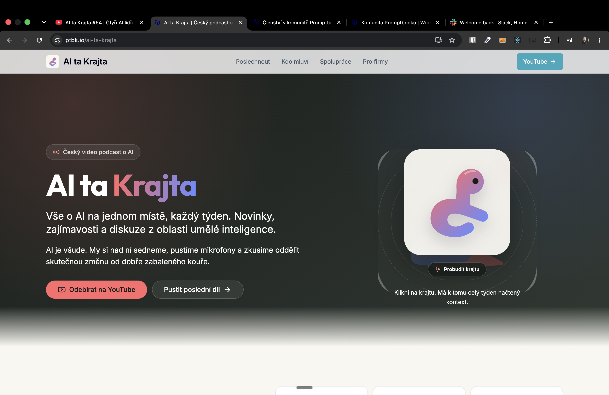

[x] by Claude Code `claude-opus-5` thinking `max` - Implementation $24.62 2 hours; Testing 3 minutes

[✨🧓] Make page `/ai-ta-krajta`

- This will be a page for the AI Ta Krajta podcast
- https://www.youtube.com/@aitakrajta_tv

- There should be:

0. The Header with the logo and navigation to the other pages of the podcast
    - The primary call to action button should be "Poslouchat" and it should lead to the last episode of the podcast which will be automatically started to play when the user clicks on it in the mini player on the bottom of the page.
1. Basic information about the podcast, where and how to subscribe
    - Do there something funny and playful: For example, make there a snake which is live and interactive, beginning as a logo.
    - Is there some Snake mini-game, but not in a grid, but similar to the snake.io
    - But everything should be branded in a podcast style and colors
2. List of the episodes And you should be able to listen to the episode directly on the page.
    - There should be some mini player fixed on bottom when the episode is played.
    - Feed it from https://anchor.fm/s/104a797ac/podcast/rss
    - In each episode, there should be a small circle with the people starring in this episode.
3. Information about the hosts and guests
    - There should be a bigger profile card with that person.
    - You click on that person. It should filter the episode with this person.
    - Save this filtration (and any other state of the page) to the get parameters.
4. Information about how to collaborate with the podcast, how to become a guest, and how to request new topics for future episodes, sponsorship, and other collaborations.
    - The lead from the partnership should lead to the contacts in `/admin`
5. Legal footer (look at other pages for inspiration)

- The page should have all the metadata for SEO and social media sharing, including Open Graph and Twitter Card tags,...
- Keep in mind the DRY _(don't repeat yourself)_ principle.
- Do a proper analysis of existing pages before you start implementing.
    - Try to reuse the components but not the whole page, because the page is for unique project

**Here are some raw notes: **

```
Landing page, které budou sloužit pro prezentaci podcastu, jako zdroj veškerých informací o tom, jak s námi spolupracovat, jak se případně stát hostem a jak požádat o nová témata. do budoucna pro nás. .

Prezentační landing page, kde bude o tom, co je AI ta krajta, kde nás všude lidi najdou.

Dáme tam ten one-pager jako záložku pro firmy, aby jsme jasně komunikovali i ceny, aby přesně věděli transparentně: „Hej, za tolik dostanete tohle a tohle.“

A případně jak se stát hostem, že nám mají jako napsat na sockách.

Udělám to takhle minimalisticky. Back office bych řešil potom.
```





**And here how to avoid sloppiness:**

- Avoid bullshit things like badges like "Český video podcast o AI"
  

```markdown
# Unslop

Edit text to remove AI patterns and add human voice.

## Process

1. Scan for the patterns below.
2. Rewrite. Preserve meaning, match intended tone.
3. Add soul (see next section).
4. Self-audit: "What makes this obviously AI generated?" Fix remaining tells.

## Adding soul

Removing patterns is half the job. Sterile, voiceless writing is just as obvious.

- **Have opinions.** React to facts instead of neutrally listing pros and cons.
- **Vary rhythm.** Short sentences. Then longer ones that take their time. Mix it up.
- **Acknowledge complexity.** "Impressive but also kind of unsettling" beats "impressive."
- **Use "I" when it fits.** First person isn't unprofessional.
- **Let some mess in.** Perfect structure looks machine-made.
- **Be specific.** Not "this is concerning" but "there's something unsettling about agents churning away at 3am."

## Patterns to detect and fix

### Content

1. **Puffery.** "pivotal moment", "testament to", "evolving landscape", "setting the stage for", "indelible mark", "deeply rooted". Cut puffery, state what happened.
2. **Name-dropping.** Listing media outlets without context. Pick one, say what was said.
3. **Superficial -ing phrases.** "highlighting...", "ensuring...", "reflecting...", "showcasing...", "fostering...". Delete or expand with real sources.
4. **Promotional language.** "nestled", "vibrant", "breathtaking", "groundbreaking", "renowned", "stunning", "must-visit". Use neutral descriptions.
5. **Vague attributions.** "Experts believe", "Industry reports suggest", "Some critics argue". Name the source or delete.
6. **Formulaic challenges.** "Despite challenges... continues to thrive." Replace with specific facts.

### Language

7. **AI vocabulary.** Additionally, crucial, delve, enduring, enhance, fostering, garner, interplay, intricate, landscape (abstract), pivotal, showcase, tapestry (abstract), testament, underscore, vibrant. Replace with plain words.
8. **Fancy ways to say "is".** "serves as", "stands as", "boasts", "features". Just say "is" or "has".
9. **"Not just X, but Y."** State the point directly instead.
10. **Rule of three.** Forcing ideas into groups of three. Use the natural number.
11. **Synonym cycling.** Protagonist, main character, central figure, hero all in one paragraph. Pick one, repeat it.
12. **False ranges.** "from X to Y" where X and Y aren't on a meaningful scale. List topics directly.

### Style

13. **Em dash overuse.** Avoid em dashes entirely. Use periods or commas only (no parentheses, no en dashes, no hyphen-as-dash substitutes). Em dashes are an AI tell, and reaching for parentheses instead just trades one tell for another. If a thought needs separation, end the sentence or use a comma.
14. **Colon overuse.** Colons are fine before a list or example. Not as mid-sentence connectors. "If you're coming from traditional automation: instead of registering event handlers, you describe conditions" adds nothing with the colon. Rewrite to let the point stand on its own without comparison framing. "Describing when the scheduler should fire works best as plain English." Same meaning, no crutch punctuation.
15. **Boldface overuse.** Don't bold every proper noun or acronym.
16. **Inline-header lists.** The tell is a bold label and colon that restates the line: "**Performance:** Performance improved...". Convert those to prose. A bold lead-in that ends in a period, names the item, and is followed by genuinely new detail ("**Schema in TypeScript.** Tables live in one file.") is fine, not a tell.
17. **Title case headings.** Use sentence case.
18. **Decorative emojis.** Remove from headings and bullets.
19. **Curly quotes.** Replace with straight quotes.

### Communication artifacts

20. **Chatbot phrases.** "I hope this helps!", "Let me know if...", "Of course!", "Certainly!", "Found the smoking gun!" Remove.
21. **Cutoff disclaimers.** "While specific details are limited..." Find sources or remove.
22. **Sycophantic tone.** "Great question! You're absolutely right!" Respond directly.

### Filler

23. **Filler phrases.** "In order to" becomes "To". "Due to the fact that" becomes "Because". "It is important to note that" gets deleted.
24. **Excessive hedging.** "could potentially possibly be argued that it might" becomes "may".
25. **Generic conclusions.** "The future looks bright." State specific plans or facts.

### Jargon

26. **Abstract metaphor nouns.** Substrate, wedge, vector, locus, vantage, nexus, primitive (as noun), harness (as metaphor), surface (as in "API surface"), bedrock, scaffolding (as metaphor), modality, paradigm, gold-plating, ratchet (as metaphor), evacuate (for moving code), endgame, north star, flywheel. These read as technical but usually have a plainer concrete word. "Substrate" becomes "base". "Wedge in" becomes "add". "Vector" becomes "way" or "method". "Gold-plating" becomes "more than the job needs". "Ratchet" becomes the mechanism's real name or "a limit that only tightens". "Evacuate" becomes "move out". "Endgame" becomes "the last phase". Pick the concrete word.

### Plain speech

27. **Say what it does, not how it feels.** "the database stays close at hand", "SQL you can read", "types that follow your schema" name a feeling. The fix names the mechanism or a number: "`.toSQL()` returns the exact string sent to the database", "a column rename fails the build". Ask what the sentence tells the reader to do or know, then write that. If you can't restate it as a concrete instruction, fact, or number, cut it. One more check: if the sentence could appear unchanged in another project's docs, it says nothing about this one. Cut it.
28. **Shorten or split dense sentences.** If the reader has to backtrack to parse a sentence, break it in two or drop clauses. One idea per sentence.
29. **Active voice.** Prefer it. Catch "is/are/was/were + past participle" and name the actor: "queries are validated" becomes "the compiler validates queries", "the file is parsed by the loader" becomes "the loader parses the file". Passive is fine only when the actor is unknown or genuinely doesn't matter.
30. **Cut adverbs, or use a stronger verb.** "runs quickly" becomes "is fast" or the number. "significantly improves" becomes the measured delta. An adverb propping up a weak verb means the verb is wrong.
31. **Prefer the plain word.** "utilize" becomes "use", "leverage" becomes "use", "facilitate" becomes "help", "numerous" becomes "many", "in the event that" becomes "if". The fancier synonym is rarely clearer.
```

