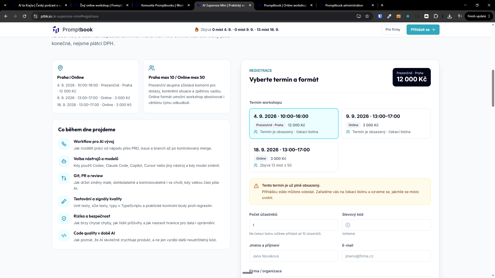
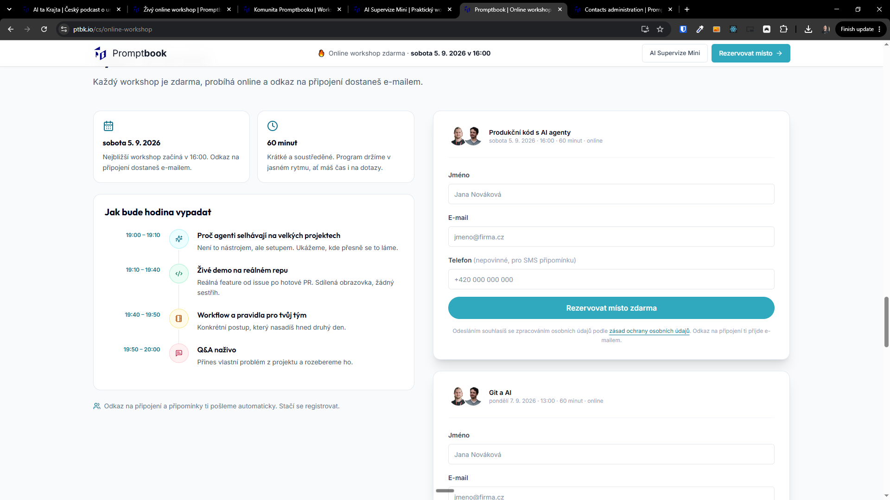
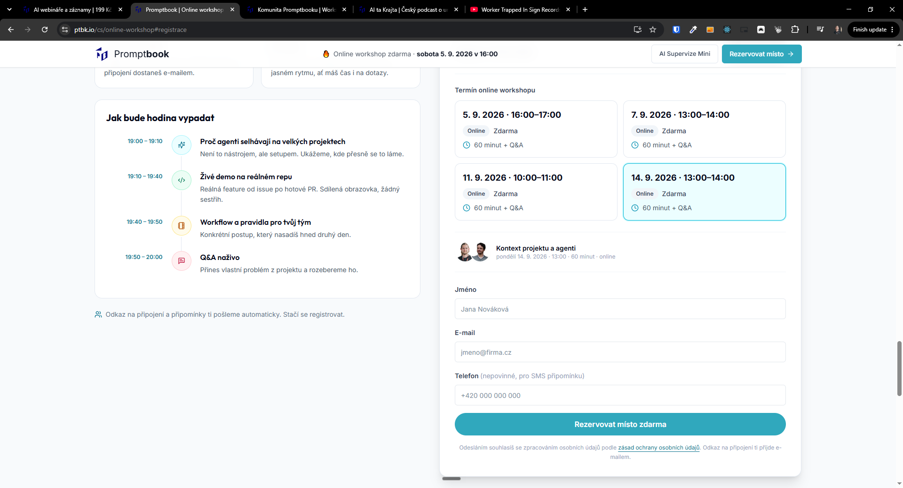

[x] by OpenAI Codex `gpt-5.6-terra` thinking `max` (ChatGPT account) - Implementation ~$0.2485 5 minutes; Testing 5 minutes

[✨🚔] Create some nice picker for online workshops

- Do not duplicate same form for every online workshop
- Get inspiration from `/ai-supervize-mini`
- You are working with page `/cs/online-workshop`
- Keep in mind the DRY _(don't repeat yourself)_ principle.
- Do a analysis of the current functionality before you start implementing.
- Add the changes into the [changelog](./changelog/_current-preversion.md)

---

[x] by Claude Code `claude-opus-5` thinking `max` - Implementation $9.00 17 minutes; Testing 5 minutes

[✨🚔] There should be name and description of the online workshop directly on the badge

- Keep in mind the DRY _(don't repeat yourself)_ principle.
- Do a analysis of the current functionality before you start implementing.

