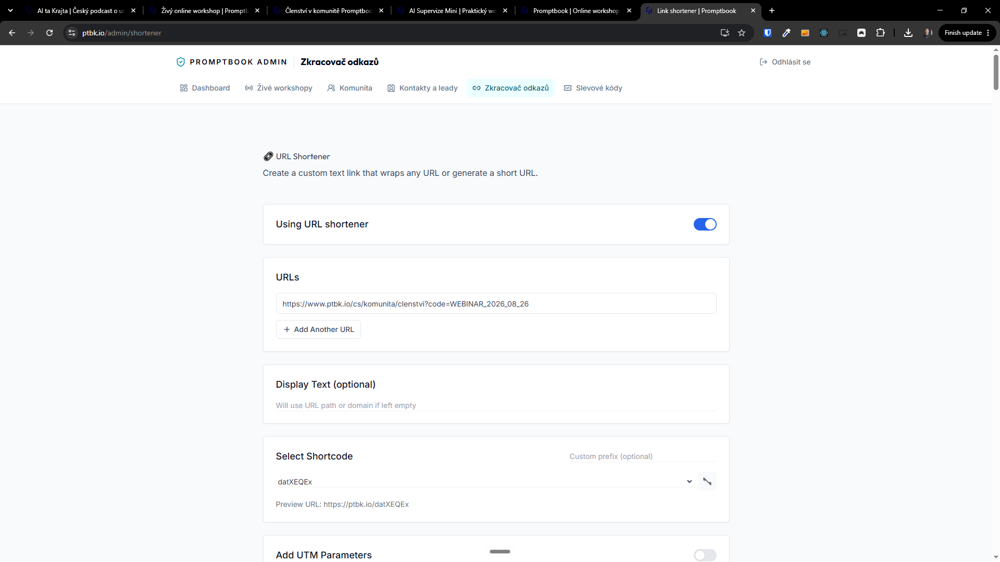
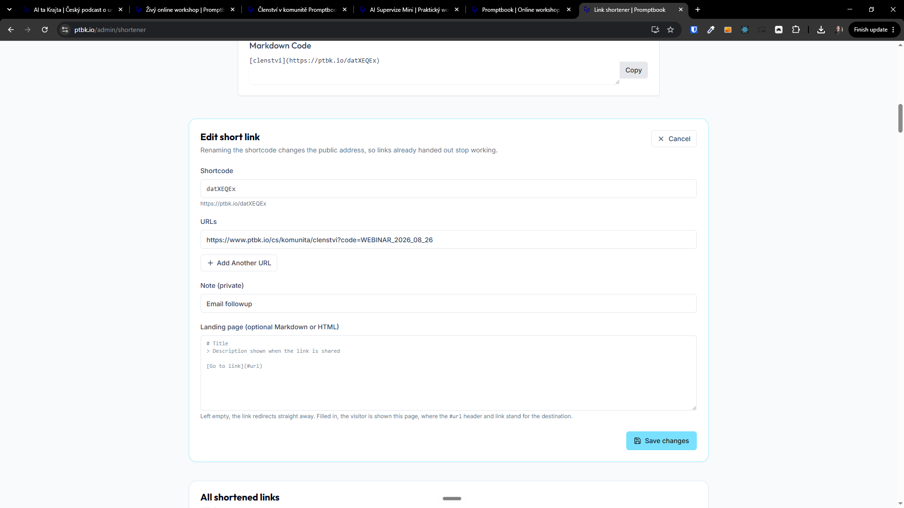

[ ]

[✨🥉] When creating short code in the URL shortener always allows to write custom node.

- You are working with page `/cs/@@@`
- Keep in mind the DRY _(don't repeat yourself)_ principle.
- Do a analysis of the current functionality before you start implementing.
- Add the changes into the [changelog](./changelog/_current-preversion.md)

