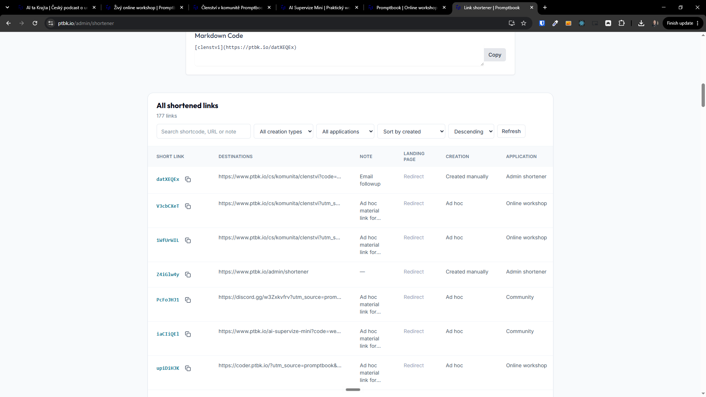
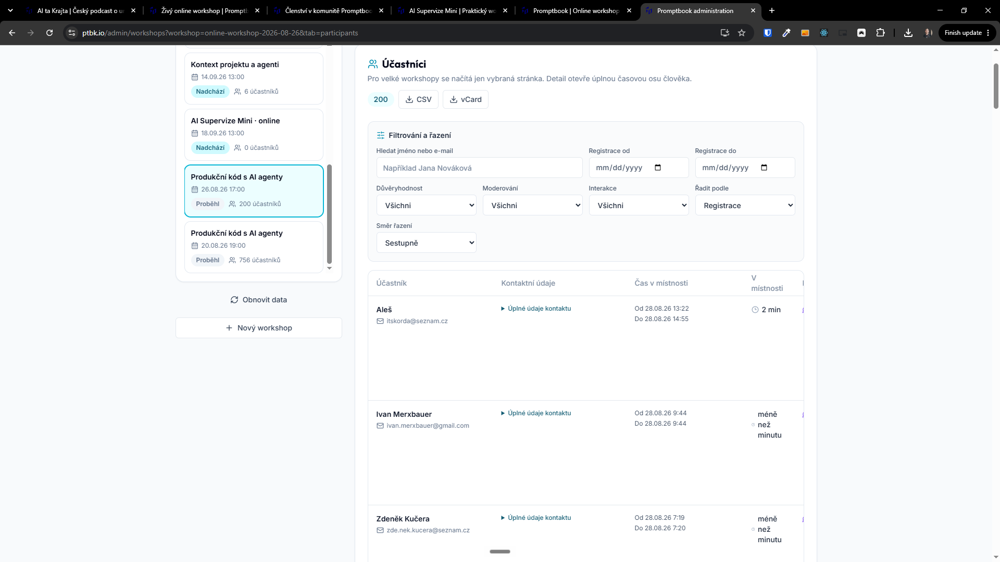

[ ]

[✨💍] Fix horizontal scrollings in admin

- Across the administration, there are multiple tables which are not shown fully because they have a very big width. But there is no horizontal scroll bar, or the horizontal scroll bar is on the bottom of the table.
- The horizontal scroll bar should be always fixed on the bottom of the table, and it should be always visible. even when the user scrolls down the page.
- The solution should be implemented in a reusable way, so it can be applied to all tables in the admin.
- Try to smartly pin the most important column of the table in some smart way, for example, the name of the person or shortcode from the shortener should be visible always.
- You are working with pages in `/admin`
- Keep in mind the DRY _(don't repeat yourself)_ principle.
- Do a analysis of the current functionality before you start implementing.
- Add the changes into the [changelog](./changelog/_current-preversion.md)

