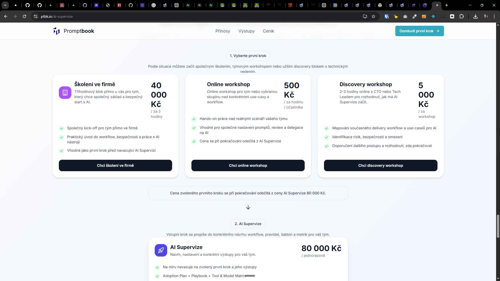
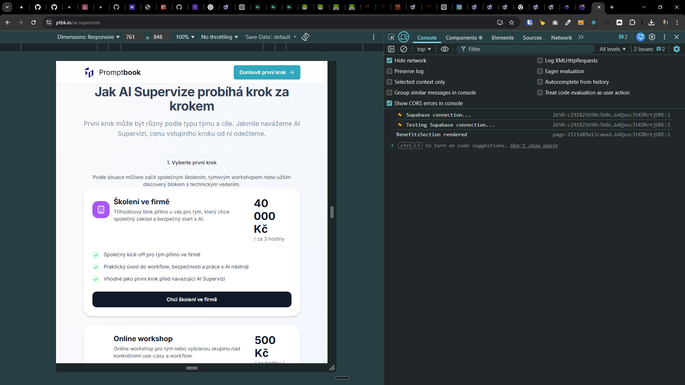

[x] ~$0.00 9 minutes by GitHub Copilot `gpt-5.4`

---

[ ]

Možnost školení a workshopu k AI Supervizi

- Může být jedna z možností, jak začít supervizi.

S tím, že školení má stát 40 000 korun za tři hodiny, když přijdeme do firmy, a účast na workshopu má stát 500 korun za hodinu online workshopu za účastníka.
Oboje by se pak započítalo do ceny supervize, pokud by dále týmy pokračovaly v supervizi.

- Mix the limeline with pricing plans
- Logic of it is:

```
"Školení ve firmě" - 40 000 Kč za 3 hodiny                           --->-|
"Online workshop" - 500 Kč za hodinu za účastníka                    --->-|-->- AI Supervize - 80 000 Kč -->- Follow-up - 15 000 Kč / měsíc
"Discovery Workshop" - 2-3 hodiny online s CTO/Tech Leadem 5 000 Kč  --->-|

```

The price of the first step is deductable from the total price of the AI Supervize.

Make it visually better:


